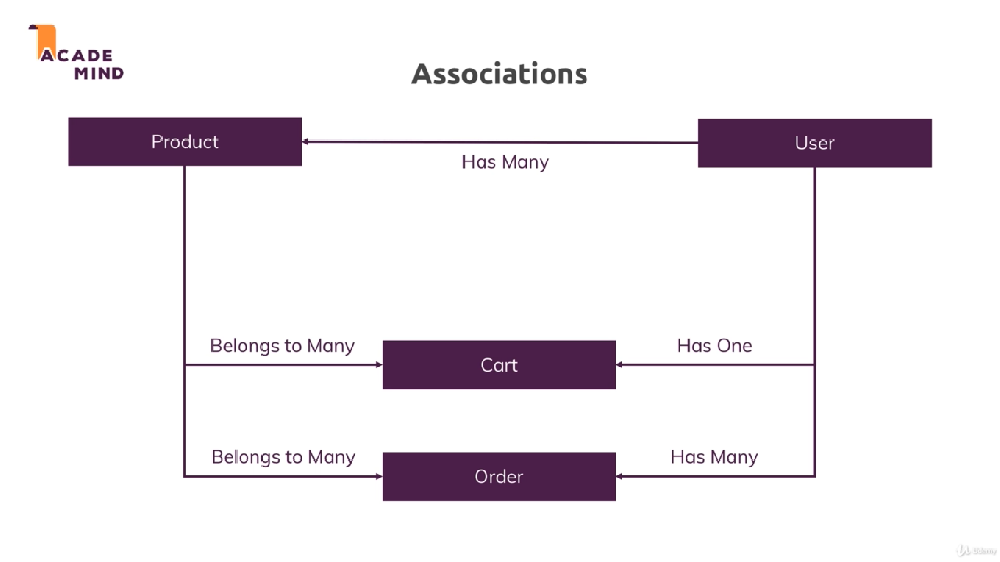

# Section 11. Understanding Sequelize

### lecture 146. What is Sequelize?

Sequelize란?
* ORM(object relational mapping) 라이브러리
* 복잡하고 긴 SQL 코드를 자바스크립트 오브젝트로 매핑시켜주는 편리한 메서드들을 제공한다
* 직접 SQL 코드를 작성할 필요가 없다

간단한 예제
* User 테이블은 name, age, email, password 필드를 가지고 있다
* Sequelize를 사용하면 {name:'qveqr' age:25 email:'vemqe@mveqr.com' password:'sfae'}만 작성하면 된다
* 뒷단에서 라이브러리가 자동으로 변경해준다
```js
const user = User.create({name:'qveqr' age:25 email:'vemqe@mveqr.com' password:'sfae'});
```
```sql
INSERT INTO user (name, age, email, password) VALUES ('qveqr', 25, 'vemqe@mveqr.com', 'sfae');
```

---

### lecture 147. Connecting to the Database

시퀄라이즈 다운로드
```terminal
$ npm i --save sequelize
```

시퀄라이즈를 이용한 데이터베이스 연결 코드 작성하기
```js
// util/database.js
const Sequelize = require('sequelize');

const sequelize = new Sequelize('node-complete', 'root', 'your password', {
    dialect: 'mysql',
    host: 'localhost'
});

module.exports = sequelize;
```
* database명, 사용자명, 비밀번호, 다양한 옵션을 인자로 받는다
* dialect는 mysql의 sql문법을 사용한다는 것을 명확하게 가리켜준다
* host를 지정하지 않으면 localhost가 자동으로 지정된다

---

### lecture 148. Defining a Model

시퀄라이즈를 이용해 product테이블 코드 작성
```js
// models/product.js
const Sequelize = require('sequelize');

const sequelize = require('../util/database');

const Product = sequelize.define('product', {
  id: {
    type: Sequelize.INTEGER,
    autoIncrement: true,
    allowNull: false,
    primaryKey: true
  },
  title: Sequelize.STRING,
  price: {
    type: Sequelize.DOUBLE,
    allowNull: false
  },
  imageUrl: {
    type: Sequelize.STRING,
    allowNull: false
  },
  description: {
    type: Sequelize.STRING,
    allowNull: false
  }
});

module.exports = Product;
```

---

### lecture 149. Syncing JS Definitions to the Database

작성한 product코드로 시퀄라이즈를 이용해 실제 데이터베이스 테이블을 생성하기
```js
// app.js
(...)
const sequelize = require('./util/database');

(...)
sequelize
  .sync()
  .then(result => {
    console.log(result);
    app.listen(3000);
  })
  .catch(e => {
    console.log(e);
  });
```
* Sequelize.sync()는 앞서 Sequelize.define()을 통해 정의한 모델들을 실제 테이블로 생성한다
* 비동기 코드이기 때문에 포트를 지정하는 코드를 대너블 체인 안으로 이동시켰다
* 기본으로 IF NOT EXISTS를 적용해주기 때문에 서버를 다시 실행한다고 해서 기존 테이블을 덮어쓰지 않는다
* mysql workbench에서 생성된 테이블을 확인해보면 자동으로 추가된 필드 2가지가 있다
  - createdAt, updatedAt은 각각 생성, 수정에 대한 타임스탬프다
  - 자동으로 이 필드들이 생성되는 것이 싫으면 옵션을 추가하면 된다

---

### lecture 150. Inserting Data & Creating a Product

생성한 모델을 이용해 데이터 추가하기
```js
// controllers/admin.js
(...)
exports.postAddProduct = (req, res, next) => {
  const title = req.body.title;
  const imageUrl = req.body.imageUrl;
  const price = req.body.price;
  const description = req.body.description;
 
  Product
    .create({
      title : title,
      price : price,
      imageUrl : imageUrl,
      description : description
    })
    .then(result => {
      console.log('CREATED PRODUCT!');
      res.redirect('/admin/products');
    })
    .catch(err => console.log(err));
};
(...)
```
* create메서드에 자바스크립트 오브젝트를 필드들을 채워 넘겨주면 된다

---

### lecture 151. MUST READ: findById() in Sequelize 5

One quick note:

With Sequelize v5, findById() (which we'll use in this course) was replaced by findByPk()
You use it in the same way, so you can simply replace all occurrences of findById() with findByPk()
* findById가 findByPk로 대체되었고 사용방법은 같다

---

### lecture 152. Retrieving Data & Finding Products

인덱스 페이지와 상품 페이지 작동을 위한 코드 작성하기
```js
// controllers/shop.js
(...)
exports.getProducts = (req, res, next) => {
  Product
    .findAll(/* {where: } */)
    .then(products => {
      res.render('shop/product-list', {
        prods: products,
        pageTitle: products.title,
        path: '/products'
      });
    })
    .catch(e => console.log(e));
};
(...)
exports.getIndex = (req, res, next) => {
  Product
    .findAll(/* {where: } */)
    .then(products => {
      res.render('shop/index', {
        prods: products,
        pageTitle: 'Shop',
        path: '/'
      });
    })
    .catch(e => console.log(e));
};
```
* findAll 메서드는 조건에 맞는 모든 데이터를 가져온다
* where 절을 {where : 조건} 형식으로 작성할 수 있다

---

### lecture 153. Getting a Single Product with the "where" Condition

조건절을 이용해 상품 한 개만 가져오기
```js
// controllers/shop.js
(...)
exports.getProduct = (req, res, next) => {
  const prodId = req.params.productId;
  Product.findByPk(prodId)
    .then(product => {
      res.render('shop/product-detail', {
        product: product,
        pageTitle: product.title,
        path: '/products'
      });
    })
    .catch(e => console.log);
};
(...)
```
* findByPk는 id값을 활용해 일치하는 상품을 가져온다

findAll을 이용해서 같은 결과를 도출하기
```js
Product.findAll({where: {id: prodId}})
    .then(products => {
      res.render('shop/product-detail', {
        product: products[0],
        pageTitle: products[0].title,
        path: '/products'
      });
    })
    .catch(e => console.log);
```
* findAll에 where절을 이용해 같은 결과를 도출해낼 수 있다
* 다른 점은 반환되는 값이 배열이라는 점이다

---

### lecture 154. Fetching Admin Products

Admin 페이지에서 상품을 조회할 수 있도록 코드 작성하기
```js
// controllers/admin.js
(...)
exports.getProducts = (req, res, next) => {
  Product
    .findAll()
    .then(products => {
      res.render('admin/products', {
        prods: products,
        pageTitle: 'Admin Products',
        path: '/admin/products'
      });
    })
    .catch(err => console.log(err));
};
(...)
```

---

### lecture 155. Updating Products

업데이트할 요소를 가져오고 수정요소를 데이터베이스에 적용하기
```js
// controllers/admin.js
(...)
exports.getEditProduct = (req, res, next) => {
  const editMode = req.query.edit;
  if (!editMode) {
    return res.redirect('/');
  }
  const prodId = req.params.productId;
  Product.findByPk(prodId)
    .then(product => {
      if (!product) {
        return res.redirect('/');
      }
      res.render('admin/edit-product', {
        pageTitle: 'Edit Product',
        path: '/admin/edit-product',
        editing: editMode,
        product: product
      });
    })
    .catch(err => console.log(err));
};

exports.postEditProduct = (req, res, next) => {
  const prodId = req.body.productId;
  const updatedTitle = req.body.title;
  const updatedPrice = req.body.price;
  const updatedImageUrl = req.body.imageUrl;
  const updatedDesc = req.body.description;
  
  Product.findByPk(prodId)
    .then(product => {
      product.title = updatedTitle;
      product.price = updatedPrice;
      product.imageUrl = updatedImageUrl;
      product.description = updatedDesc;
      return product.save();
    })
    .then(result => {
      console.log("UPDATED PRODUCT!");
      res.redirect('/admin/products');
    })
    .catch(err => console.log(err));
};
(...)
```
* findByPk로 개별 데이터를 가져와서 수정사항을 적용하고 save 메서드를 호출한다
* save 메서드를 호출한 것을 리턴해서 대너블체인으로 한 번 더 연결한 다음 응답 코드를 실행하고 있다

---

### lecture 156. Deleting Products

삭제 로직 추가하기
```js
// controllers/admin.js
(...)
exports.postDeleteProduct = (req, res, next) => {
  const prodId = req.body.productId;
  Product.findByPk(prodId)
    .then(product => {
      return product.destroy();
    })
    .then(result => {
      console.log('DESTROYED PRODUCT!');
      res.redirect('/admin/products');
    })
    .catch(err => console.log(err));
};
(...)
```
* id로 데이터를 찾아낸 다음 destroy메서드를 호출한 것을 리턴한다
* 리턴한 프로미스를 대너블 체인을 이용해 응답 코드를 실행한다

---

### lecture 157. Creating a User Model

user 테이블 생성하기
```js
// models/user.js
const Sequelize = require('sequelize');

const sequelize = require('../util/database');

const User = sequelize.define('user', {
  id: {
    type: Sequelize.INTEGER,
    autoIncrement: true,
    allowNull: false,
    primaryKey: true
  },
  name: Sequelize.STRING,
  email: Sequelize.STRING
});

module.exports = User;
```

---

### lecture 158. Adding a One-To-Many Relationship

쇼핑몰 모델들의 관계


유저와 상품에 1:N관계 적용하기
```js
// app.js
(...)
const Product = require('./models/product');
const User = require('./models/user');

(...)
Product.belongsTo(User, { constraints: true, onDelete: 'CASCADE' });
User.hasMany(Product);
(...)
```
* belongsTo는 메서드를 호출한 모델이 첫 번째 인자로 넘어온 모델에 속하도록(1:N) 관계 맺는다
* 두번째 인자에는 여러 옵션들을 지정할 수 있다
* onDelete는 관계맺은 데이터가 사라졌을 때 처리방식을 지정한 것이다
* 이렇게만 코드를 작성하면 기존 테이블이 있는 경우 관계가 적용되지 않는다

이미 작성된 테이블이 있으면 덮어쓰도록 강제하기
```js
// app.js
(...)
sequelize
  .sync({ force: true })
  .then(result => {
    app.listen(3000);
  })
  .catch(e => {
    console.log(e);
  });
```
* sync 메서드에 force를 true로 지정하면 기존 테이블을 강제로 덮어쓴다
* workbench에서 확인해보면 관계가 지정됐음을 확인할 수 있다
* 매번 서버를 실행할때마다 테이블을 덮어쓰지 않으려면 한번만 적용하고 force는 지워야한다

---

### lecture 159. Creating & Managing a Dummy User

인증을 적용하지 않은 상태에서 더미 유저 생성하기
```js
// app.js
(...)
sequelize
  .sync()
  .then(result => {
    return User.findByPk(1);
  })
  .then(user => {
    if (!user) {
      return User.create({ name: 'ES', email: 'esbae@google.com' });
    }
    return Promise.resolve(user);
  })
  .then(user => {
    app.listen(3000);
  })
  .catch(e => {
    console.log(e);
  });

```

요청이 들어올때마다 프로퍼티에 user가 생성되어 있도록 미들웨어 만들기
```js
// app.js
(...)
app.use((req, res, next) => {
  User.findByPk(1)
    .then(user => {
      req.user = user;
      next();
    })
    .catch(err => console.log(err));
});
(...)
```
* 이 미들웨어는 시퀄라이즈가 sync하기 이전에 절대 실행되지 않는다
* 미들웨어는 오직 사용자의 요청이 들어왔을 때 실행된다

---

### lecture 160. Using Magic Association Methods

앞서 만든 더미유저를 상품이 추가될 때마다 연동하기
```js
// controllers/admin.js
(...)
exports.postAddProduct = (req, res, next) => {
  const title = req.body.title;
  const imageUrl = req.body.imageUrl;
  const price = req.body.price;
  const description = req.body.description;
 
  Product
    .create({
      title : title,
      price : price,
      imageUrl : imageUrl,
      description : description,
      userId: req.user.id
    })
    .then(result => {
      console.log('CREATED PRODUCT!');
      res.redirect('/admin/products');
    })
    .catch(err => console.log(err));
};
(...)
```
* userId 필드를 미들웨어로 넘겨준 req.user를 이용해서 지정하고 있다

hasMany 관계일때 시퀄라이즈가 제공하는 마법같은 메소드
```js
exports.postAddProduct = (req, res, next) => {
  const title = req.body.title;
  const imageUrl = req.body.imageUrl;
  const price = req.body.price;
  const description = req.body.description;
 
  req.user.createProduct({
      title : title,
      price : price,
      imageUrl : imageUrl,
      description : description,
    })
    .then(result => {
      console.log('CREATED PRODUCT!');
      res.redirect('/admin/products');
    })
    .catch(err => console.log(err));
};
```
* 직접 userId를 지정하지 않으면서 위 코드와 똑같이 동작한다

---

### lecture 161. Fetching Related Products

상품을 가져올 때 유저를 이용하기
```js
// controllers/admin.js
(...)
exports.getEditProduct = (req, res, next) => {
  const editMode = req.query.edit;
  if (!editMode) {
    return res.redirect('/');
  }
  const prodId = req.params.productId;
  req.user
    .getProducts( { where : { id: prodId } })
    .then(product => {
      if (!product) {
        return res.redirect('/');
      }
      res.render('admin/edit-product', {
        pageTitle: 'Edit Product',
        path: '/admin/edit-product',
        editing: editMode,
        product: product
      });
    })
    .catch(err => console.log(err));
};

(...)
exports.getProducts = (req, res, next) => {
  req.user
    .getProducts()
    .then(products => {
      res.render('admin/products', {
        prods: products,
        pageTitle: 'Admin Products',
        path: '/admin/products'
      });
    })
    .catch(err => console.log(err));
};
```

---

### lecture 162. One-To-Many & Many-To-Many Relations

쇼핑몰을 완성시키기 위해서는 Product와 User외에 Cart모델도 필요하다
* 이전 강의에서 봤던대로 Cart는 한 User에 속하고 여러 Product들을 가진다
* Cart안에는 여러 Product들이 있는데 각 Product는 다시 여러 개의 수량을 가질 수 있다
* 이를 다루기 위해 quantity필드를 가진 CartItem모델을 추가한다
  - CartItem을 가지고 Cart와 Product 간의 M:N 관계를 다룰 것이다
* 한 Cart는 여러 Product를 가지고, 반대로 한 Product도 여러 Cart를 가질 수 있다

```js
// models/cart.js
const Sequelize = require('sequelize');

const sequelize = require('../util/database');

const Cart = sequelize.define('cart', {
  id: {
    type: Sequelize.INTEGER,
    autoIncrement: true,
    allowNull: false,
    primaryKey: true
  }
});

module.exports = Cart;

// models/cart-item.js
const Sequelize = require('sequelize');

const sequelize = require('../util/database');

const CartItem = sequelize.define('cartItem', {
  id: {
    type: Sequelize.INTEGER,
    autoIncrement: true,
    allowNull: false,
    primaryKey: true
  },
  quantity: Sequelize.INTEGER
});

module.exports = CartItem;
```

메인파일에 관계 지정하기
```js
// app.js
(...)
const Cart = require('./models/cart');
const CartItem = require('./models/cart-item');
(...)
Product.belongsTo(User, { constraints: true, onDelete: 'CASCADE' });
User.hasMany(Product);
User.hasOne(Cart);
Cart.belongsTo(User);
Cart.belongsToMany(Product, { through: CartItem });
Product.belongsToMany(Cart, { through: CartItem });
```
* User.hasOne(Cart)과 Cart.belongsTo(User)는 같은 로직이므로 User.hasOne(Cart)만 실행해도 된다
* Cart.belongsToMany(Product, { through: CartItem }), Product.belongsToMany(Cart, { through: CartItem })
  - through에 CartItem을 지정함으로써 CartItem이 Cart와 Product의 M:N관계를 잇는 중개모델이 된다

모델 적용을 위해 sync에 force 적용
```js
// app.js
(...)
sequelize
  .sync({ force: true })
  // .sync()
  (...)
```
* 이 역시 한번 강제적용으로 덮어쓴 뒤에는 주석처리한다

---

### lecture 163. Creating & Fetching a Cart

getCart컨트롤러를 수정
* req.user를 이용해 user가 보유한 카트의 상품들을 렌더링하는 로직 작성
```js
// controller/shop.js
(...)
exports.getCart = (req, res, next) => {
  req.user.getCart()
    .then(cart => {
      console.log(cart);
    })
    .catch(err => console.log(err));
};
(...)
```
* cart의 로그를 찍어보면 null이 나온다
* user를 생성할 때 cart를 동시에 생성해주지 않았기 때문이다

user생성 이후 cart를 생성하는 로직 추가
```js
// app.js
(...)
sequelize
  // .sync({ force: true })
  .sync()
  .then(result => {
    return User.findByPk(1);
  })
  .then(user => {
    if (!user) {
      return User.create({ name: 'ES', email: 'esbae@google.com' });
    }
    return Promise.resolve(user);
  })
  .then(user => {
    return user.createCart();
  })
  .then(cart => {
    app.listen(3000);
  })
  .catch(e => {
    console.log(e);
  });
```

getCart를 완성하기
```js
// controllers/shop.js
(...)
exports.getCart = (req, res, next) => {
  req.user.getCart()
    .then(cart => {
      return cart
        .getProducts()
        .then(products => {
          res.render('shop/cart', {
            path: '/cart',
            pageTitle: 'Your Cart',
            products: products
          });
        })
        .catch(err => console.log(err));
    })
    .catch(err => console.log(err));
};
(...)
```

---

### lecture 164. Adding New Products to the Cart

postCart로 카트에 상품을 추가하는 로직 작성하기
```js
// controllers/shop.js
(...)
exports.postCart = (req, res, next) => {
  const prodId = req.body.productId;
  let fetchedCart;
  req.user.getCart()
    .then(cart => {
      fetchedCart = cart;
      return cart.getProducts({where : {id: prodId}})
    })
    .then(products => {
      let product;
      if (products.length > 0) {
        product = products[0];
      }
      let newQuantity = 1;
      if (product) {
        //...
      }
      return Product.findByPk(prodId)
        .then(product => {
          return fetchedCart.addProduct(product, {
            through: { quantity: newQuantity }
          });
        })
        .catch(err => console.log(err));
    })
    .then(_ => {
      res.redirect('/cart');
    })
    .catch(err => console.log(err));
};
(...)
```
* req.user를 통해 cart를 가져온다
* cart에 product의 id에 해당하는 상품이 있는지 확인한다
* 상품이 없으면 카트에 quantity를 1로 지정해 추가한다
* 상품이 이미 있는 경우의 로직은 다음 강의에서 작성할 것이다
* 작업이 완료되면 /cart로 리다이렉트한다

---

### lecture 165. Adding Existing Products & Retrieving Cart Items

```html
<!-- views/shop/cart.ejs 수정전 -->
<%- include('../includes/head.ejs') %>
  <link rel="stylesheet" href="/css/cart.css">
  </head>
  <body>
      <%- include('../includes/navigation.ejs') %>
      <main>
        <% if (products.length > 0) { %>
          <ul class="cart__item-list">
            <% products.forEach(p => { %>
              <li class="cart__item">
                <h1><%= p.productData.title %></h1>
                <h2>Quantity: <%= p.qty %></h2>
                <form action="/cart-delete-item" method="POST">
                  <input type="hidden" value="<%= p.productData.id %>" name="productId">
                  <button class="btn danger" type="submit">Delete</button>
                </form>
              </li>
            <% }) %>
          </ul>
        <% } else { %>
          <h1>No Products in Cart!</h1>
        <% } %>
      </main>
      <%- include('../includes/end.ejs') %>
```
* 앞서 파일시스템을 이용할때 사용했던 데이터구조는 더 이상 필요없다
  - productData 같은 불필요한 계층을 없애주자

```html
<!-- views/shop.cart.ejs 수정후 -->
<%- include('../includes/head.ejs') %>
    <link rel="stylesheet" href="/css/cart.css">
    </head>

    <body>
        <%- include('../includes/navigation.ejs') %>
        <main>
            <% if (products.length > 0) { %>
                <ul class="cart__item-list">
                    <% products.forEach(p => { %>
                        <li class="cart__item">
                            <h1><%= p.title %></h1>
                            <h2>Quantity: <%= p.cartItem.quantity %></h2>
                            <form action="/cart-delete-item" method="POST">
                                <input type="hidden" value="<%= p.id %>" name="productId">
                                <button class="btn danger" type="submit">Delete</button>
                            </form>
                        </li>
                    <% }) %>
                </ul>
            <% } else { %>
                <h1>No Products in Cart!</h1>
            <% } %>
        </main>
        <%- include('../includes/end.ejs') %>
```
* product에서 cartItem을 이용해 수량을 구하고 있다

카트에 이미 product가 있는 경우를 처리
```js
// controllers/shop.js
(...)
exports.postCart = (req, res, next) => {
  const prodId = req.body.productId;
  let fetchedCart;
  let newQuantity = 1;
  req.user.getCart()
    .then(cart => {
      fetchedCart = cart;
      return cart.getProducts({where : {id: prodId}})
    })
    .then(products => {
      let product;
      if (products.length > 0) {
        product = products[0];
      }
      if (product) {
        const oldQuantity = product.cartItem.quantity;
        newQuantity = oldQuantity + 1;
        return product;
      }
      return Product.findByPk(prodId)
    })
    .then(product => {
      return fetchedCart.addProduct(product, {
        through: { quantity: newQuantity }
      });
    })
    .then(_ => {
      res.redirect('/cart');
    })
    .catch(err => console.log(err));
};
(...)
```
* product가 있으면 기존 quantity에 1을 더한 값을 새 quantity로 적용해준다

---

### lecture 166. Deleting Related Items & Deleting Cart Products

카트에서 상품을 삭제하는 로직 작성하기
* 여기서 조심해야할 것은 product를 삭제하는 것이 아니라 cartitem을 삭제하는 것이다
```js
// controllers/shop.js
(...)
exports.postCartDeleteProduct = (req, res, next) => {
  const prodId = req.body.productId;
  req.user.getCart()
    .then(cart => {
      return cart.getProducts({where: {id: prodId}})
    })
    .then(products => {
      const product = products[0];
      return product.cartItem.destroy();
    })
    .then(_ => {
      res.redirect('/cart');
    })
    .catch(err => console.log(err));
};
(...)
```
* destroy 메서드를 활용해 cartitem을 삭제하고 있다

---

### lecture 167. Adding an Order Model

주문을 위한 Order 모델 생성하기
* User는 여러 Order를 가진다(1:N)
  - Order belongs to User
  - User has many orders
* Order는 여러 Product를 가진다
  - Cart와 마찬가지로 Order에서 각 Product는 quantity를 가진다
  - 따라서 OrderItem 모델을 사용해 수량을 표시할 것이다
```js
// models/order.js
const Sequelize = require('sequelize');

const sequelize = require('../util/database');

const Order = sequelize.define('order', {
  id: {
    type: Sequelize.INTEGER,
    autoIncrement: true,
    allowNull: false,
    primaryKey: true
  },
});

module.exports = Order;

// models/order-item.js
const Sequelize = require('sequelize');

const sequelize = require('../util/database');

const OrderItem = sequelize.define('orderItem', {
  id: {
    type: Sequelize.INTEGER,
    autoIncrement: true,
    allowNull: false,
    primaryKey: true
  },
  quantity: Sequelize.INTEGER
});

module.exports = OrderItem;
```

Order와 User, Product의 관계 설정하기
```js
// app.js
(...)
const Order = require('./models/order');
const OrderItem = require('./models/order-item');
(...)
Order.belongsTo(User);
User.hasMany(Order);
Order.belongsToMany(Product, { through: OrderItem });
(...)
sequelize
  .sync({ force: true })
  // .sync()
(...)
```
* 앞서 작성한 것과 비슷한 방식이므로 다시 설명하지 않는다

---

### lecture 168. Storing Cartitems as Orderitems

Order 버튼 추가하기
```html
<!-- views/shop/cart.ejs -->
(...)
</ul>
  <hr>
  <div class="centered">
     <form action="/create-order" method="post">
       <button type="submit" class="btn">Order Now!</button>
     </form> 
  </div>
(...)
```

Order 로직 추가하기
```js
// routes/shop.js
(...)
router.post('/create-order', shopController.postOrder);
(...)

// controller/shop.js
(...)
exports.postOrder = (req, res, next) => {
  req.user.getCart()
    .then(cart => {
      return cart.getProducts()
    })
    .then(products => {
      return req.user
        .createOrder()
        .then(order => {
          return order.addProducts(products.map(product => {
            product.orderItem = { quantity: product.cartItem.quantity };
            return product;
          }));
        })
        .catch(err => console.log(err));
    })
    .then(_ => {
      res.redirect('/orders');
    })
    .catch(err => console.log(err));
};
(...)
```
* req.user로 order를 생성해서 상품들을 추가한다
* 이 때, 상품과 주문의 중간 매개체 모델인 OrderItem의 quantity를 상품의 CartItem의 quantity에서 가져온다

---

### lecture 168. Resetting the Cart & Fetching and Outputting Orders

주문을 생성한 후 카트를 비우는 로직 추가하기
```js
// controllers/shop.js
(...)
exports.postOrder = (req, res, next) => {
  let fetchedOrder;
  req.user.getCart()
    .then(cart => {
      fetchedOrder = cart;
      return cart.getProducts()
    })
    .then(products => {
      return req.user
        .createOrder()
        .then(order => {
          return order.addProducts(products.map(product => {
            product.orderItem = { quantity: product.cartItem.quantity };
            return product;
          }));
        })
        .catch(err => console.log(err));
    })
    .then(_ => {
      return fetchedCart.setProducts(null);
    })
    .then(_ => {
      res.redirect('/orders');
    })
    .catch(err => console.log(err));
};
(...)
```

getCheckout을 삭제하고 주문을 실제로 렌더링할 getOrders 작성하기
```js
(...)
// 삭제할 컨트롤러
exports.getCheckout = (req, res, next) => {
  res.render('shop/checkout', {
    path: '/checkout',
    pageTitle: 'Checkout'
  });
};
```
* 관련된 라우터도 삭제해주자

```js
exports.getOrders = (req, res, next) => {
  req.user.getOrders({include: ['products']})
    .then(orders => {
      res.render('shop/orders', {
        path: '/orders',
        pageTitle: 'Your Orders',
        orders: orders
      });
    })
    .catch(err => console.log(err));
};
```
* getOrders에 {include: ['products']}를 넘겨줘야 가져온 order마다 연관된 products들을 함께 가져온다

orders 마크업 작성하기
```html
<!-- views/shop/orders.ejs -->
<%- include('../includes/head.ejs') %>
    </head>

    <body>
        <%- include('../includes/navigation.ejs') %>
        <main>
            <% if (orders.length <= 0) { %>
              <h1>Nothing there!</h1>
            <% } else { %>
              <ul>
                <% orders.forEach(order => { %>
                  <li>
                    <h1># <%= order.id %></h1>
                    <ul>
                      <% order.products.forEach(product => { %>
                        <li><%= product.title %> (<%= product.orderItem.quantity %>)</li>
                      <% }); %>
                    </ul>
                  </li>
                <% }); %>
              </ul>
            <% } %>
        </main>
        <%- include('../includes/end.ejs') %>
```
