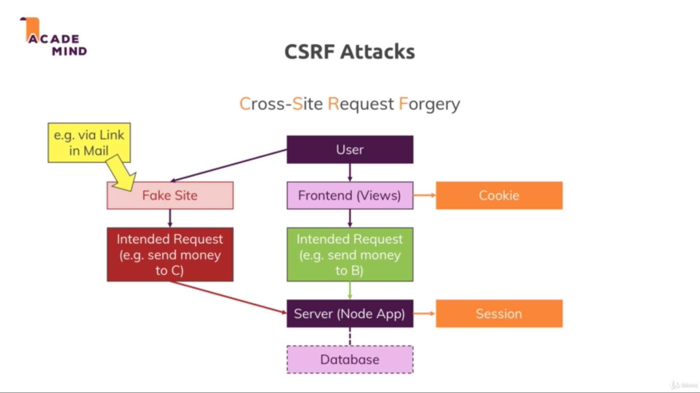

# Section 15. Adding Authentication

### lecture 250. Implementing an Authentication Flow

email과 password로 인증하도록 모델 스키마를 수정
```js
// models/user.js
(...)
const userSchema = new Schema({
  email: {
    type: String,
    required: true
  },
  password: {
    type: String,
    required: true
  },
  cart: {
    items: [
      {
        productId: {
          type: Schema.Types.ObjectId,
          ref: 'Product',
          required: true
        },
        quantity: { type: Number, required: true }
      }
    ]
  }
});
(...)
```

회원가입을 처리할 postSignup 작성하기
```js
// controllers/auth.js
(...)
exports.postSignup = (req, res, next) => {
  const email = req.body.email;
  const password = req.body.password;
  const confirmPassword = req.body.confirmPassword;

  User.findOne({ email : email })
    .then(userDoc => {
      if (userDoc) {
        return res.redirect('/');
      }
      const user = new User({
        email: email,
        password: password,
        cart: { items: [] }
      });
      return user.save();
    })
    .then(result => {
      res.redirect('/login');
    })
    .catch(err => console.log(err));
};
(...)
```
* email을 데이터베이스에 검색해 이미 존재하는 이메일이면 / 경로로 리다이렉트 시킨다
* 기존에 없는 이메일이면 폼에 채워넣은 데이터를 이용해 새로운 User를 만들어 저장한 후 /login 경로로 리다이렉트한다

유저가 없으면 더미유저를 만들던 로직 삭제
```js
// app.js
(...)
mongoose
  .connect(MONGODB_URI, { useNewUrlParser: true })
  .then(result => {
    app.listen(3000);
  })
  .catch(err => {
    console.log(err);
  });
```

---

### lecture 251. Encrypting Passwords

이전 강의에서 작성한 인증의 문제점
* 컴파스에서 비밀번호를 확인해보면 평문으로 노출되어 있다
* 암호 노출은 치명적인 보안 결함이므로 유저 정보를 저장하기 전에 암호화가 필요하다

암호화 라이브러리 설치하기
```terminal
$ npm i --save bcrpytjs
```

암호화를 적용한 회원가입 로직 작성하기
```js
// controllers/auth.js
const bcrypt = require('bcryptjs');
(...)
exports.postSignup = (req, res, next) => {
  const email = req.body.email;
  const password = req.body.password;
  const confirmPassword = req.body.confirmPassword;

  User.findOne({ email : email })
    .then(userDoc => {
      if (userDoc) {
        return res.redirect('/');
      }
      return bcrypt.hash(password, 12)
                   .then(hashedPassword => {
                     const user = new User({
                       email: email,
                       password: hashedPassword,
                       cart: { items: [] }
                     });
                     return user.save();
                   });
    })
    .then(result => {
      res.redirect('/login');
    })
    .catch(err => console.log(err));
};
(...)
```

---

### lecture 253. Adding the Signin Functionality

비밀번호 암호화를 적용한 로그인 로직 작성
```js
// controllers/auth.js
(...)
exports.postLogin = (req, res, next) => {
  const email = req.body.email;
  const password = req.body.password;

  User.findOne({ email: email })
    .then(user => {
      if (!user) {
        return res.redirect('/login');
      }
      bcrypt.compare(password, user.password)
        .then(doMatch => {
          if (doMatch) {
            req.session.isLoggedIn = true;
            req.session.user = user;
            return req.session.save(err => {
              console.log(err);
              res.redirect('/');
            });
          }
          res.redirect('/login');
        })
        .catch(err => {
          console.log(err);
          res.redirect('/login');
        });
    })
    .catch(err => console.log(err));
};
(...)
```

---

### lecture 254. Working on Route Protection

지금까지 만든 인증 기능의 문제점
* 로그인이 되어 있지 않은 상태에서 /admin/add-product 같은 경로로 접속해도 접근할 수 있다
* 세션에 저장된 로그인여부 정보를 이용해서 이를 체크해줘야 한다

```js
// controllers/admin.js
(...)
exports.getAddProduct = (req, res, next) => {
  if (!req.session.isLoggedIn) {
    return res.redirect('/login');
  }
  res.render('admin/edit-product', {
    pageTitle: 'Add Product',
    path: '/admin/add-product',
    editing: false,
    isAuthenticated: req.session.isLoggedIn
  });
};
(...)
```

---

### lecture 255. Using Middleware to Protect Routes

앞서 작성한 라우트 보호방법의 문제점
* 긴 코드를 모든 컨트롤러에 중복해서 추가해야 하므로 확장성이 떨어진다
* 보다 확장성있게 외부 파일로 로직을 분리해서 라우터에 인자로 넘기는 방식으로도 처리할 수 있다

```js
// middleware/is-auth.js
module.exports = (req, res, next) => {
  if (!req.session.isLoggedIn) {
    return res.redirect('/login');
  }
  next();
}
```

```js
// routes/admin.js
const path = require('path');

const express = require('express');

const adminController = require('../controllers/admin');
const isAuth = require('../middleware/is-auth');

const router = express.Router();

// /admin/add-product => GET
router.get('/add-product', isAuth, adminController.getAddProduct);

// /admin/products => GET
router.get('/products', isAuth, adminController.getProducts);

// /admin/add-product => POST
router.post('/add-product', isAuth, adminController.postAddProduct);

router.get('/edit-product/:productId', isAuth, adminController.getEditProduct);

router.post('/edit-product', isAuth, adminController.postEditProduct);

router.post('/delete-product', isAuth, adminController.postDeleteProduct);

module.exports = router;

// routes/shop.js
const path = require('path');

const express = require('express');

const shopController = require('../controllers/shop');
const isAuth = require('../middleware/is-auth');

const router = express.Router();

router.get('/', shopController.getIndex);

router.get('/products', shopController.getProducts);

router.get('/products/:productId', shopController.getProduct);

router.get('/cart', isAuth, shopController.getCart);

router.post('/cart', isAuth, shopController.postCart);

router.post('/cart-delete-item', isAuth, shopController.postCartDeleteProduct);

router.post('/create-order', isAuth, shopController.postOrder);

router.get('/orders', isAuth, shopController.getOrders);

module.exports = router;
```
* 라우터는 왼쪽에서 오른쪽으로 미들웨어를 실행한다

---

### lecture 256. Understanding CSRF Attacks

CSRF 공격이란
* 해커가 애플리케이션에서 악의적으로 세션에 접근하거나 특정 코드를 실행하도록 만드는 공격이다
* ex. 메일을 통해 특정 링크를 보낸다
  - 해당 링크는 메일 수신자가 자주 사용하는 송금 사이트와 유사하게 만든 페이크 사이트라고 가정해보자
  - 메일 수신자는 평소 사용하던 서비스라고 생각하고 B에게 송금한다
  - 그러나 해커가 수신자의 세션 쿠키를 이용해 C에게 송금하도록 조작한다



CSRF를 어떻게 예방할 수 있을까?
* 사용자 세션을 오직 원본 애플리케이션의 뷰에서만 조작할 수 있도록 만든다
  - 이를 구현하기 위해 자주 사용하는 방법은 csrf-token을 이용하는 것이다
  - 토큰은 일반적으로 일정한 길이의 문자열 값이다
  - 이 토큰을 유저 상태를 변경하는 모든 뷰 페이지들의 폼 속에 넣는다
  - 그리고 csrf토큰을 체크하는 라이브러리를 통해 유저 상태를 변경하는 요청이 올바른 토큰을 보유하고 있는지 체크한다
  - 페이크 사이트는 세션을 이용하기 위해 요청을 보내지만 토큰이 없으므로 세션에 접근하지 못한다
  - 그렇다고 csrf토큰을 예측하는 것은 해쉬화된 값이므로 사실상 불가능하다
  - 요청에 따른 모든 페이지마다 토큰값이 달라지므로 토큰을 탈취하는 것도 불가능하다

---

### lecture 257. Using a CSRF Token

csrf-token을 위한 라이브러리 설치
```terminal
$ npm i --save csurf
```

csurf 기본 설정
```js
// app.js
(...)
const csrf = require('csurf');
const csrfProtection = csrf();

(...)
// 세션 초기화 로직
app.use(
  session({
    secret: 'my secret',
    resave: false,
    saveUninitialized: false,
    store: store
  })
);
app.use(csrfProtection);
```
* 패키지를 미들웨어로 실행하는 것은 세션 초기화 로직 이후에 해야 한다

로그아웃 폼에 csrf토큰 설정하기
```js
// controllers/shop.js
(...)
exports.getIndex = (req, res, next) => {
  Product.find()
    .then(products => {
      res.render('shop/index', {
        prods: products,
        pageTitle: 'Shop',
        path: '/',
        isAuthenticated: req.session.isLoggedIn,
        csrfToken: req.csrfToken()
      });
    })
    .catch(err => {
      console.log(err);
    });
};
(...)
```
* req.csrfToken은 라이브러리에서 제공해주는 메서드다

```html
<!-- views/includes/navigation.ejs -->
(...)
<% } else { %>
    <li class="main-header__item">
        <form action="/logout" method="post">
            <input type="hidden" name="_csrf" value="<%= csrfToken %>" />
            <button type="submit">Logout</button>
        </form>
    </li>
<% } %>
```
* _csrf를 name으로 지정하면 라이브러리에서 자동으로 인식한다

---

### lecture 258 Adding CSRF Protection

앞서 작성한 csrf토큰 동작방식의 문제점
* 모든 컨트롤러마다 csrf토큰을 넘겨주고 뷰페이지에서 저장하는 로직을 중복작성해야 한다

```js
// controllers/shop.js
(...)
exports.getIndex = (req, res, next) => {
  Product.find()
    .then(products => {
      res.render('shop/index', {
        prods: products,
        pageTitle: 'Shop',
        path: '/'
      });
    })
    .catch(err => {
      console.log(err);
    });
};
```
* isAuthenticated와 csrfToken을 지우고 앱 전체에 해당정보가 제공되도록 미들웨어를 만들 것이다

```js
// app.js
(...)
app.use((req, res, next) => {
  res.locals.isAuthenticated = req.session.isLoggedIn;
  res.locals.csrfToken = req.csrfToken();
  next();
});
(...)
```
* res.locals에 앱 전역에서 사용할 수 있는 변수를 등록할 수 있다
* 이제 모든 컨트롤러에서 csrfToken을 넘겨줄 필요는 없다
* 물론 폼을 제출하는 뷰 페이지들에 히든 입력값으로 csrf토큰을 추가하는 코드는 작성해야한다

---

### lecture 259. Fixing the Order Button

Order는 이제 name이 아닌 email을 받아야 한다
```js
// controllers/shop.js
(...)
exports.postOrder = (req, res, next) => {
  req.user
    .populate('cart.items.productId')
    .execPopulate()
    .then(user => {
      const products = user.cart.items.map(i => {
        return { quantity: i.quantity, product: { ...i.productId._doc } };
      });
      const order = new Order({
        user: {
          email: req.user.email,
          userId: req.user
        },
        products: products
      });
      return order.save();
    })
    .then(result => {
      return req.user.clearCart();
    })
    .then(() => {
      res.redirect('/orders');
    })
    .catch(err => console.log(err));
};
(...)
```

```js
// models/order.js
(...)
const orderSchema = new Schema({
  products: [
    {
      product: { type: Object, required: true },
      quantity: { type: Number, required: true }
    }
  ],
  user: {
    email: {
      type: String,
      required: true
    },
    userId: {
      type: Schema.Types.ObjectId,
      required: true,
      ref: 'User'
    }
  }
});
(...)
```

---

### lecture 260. Providing User Feedback

로그인 실패시 에러 메시지를 유저에게 출력하기
* connect-flash라는 라이브러리를 이용해 비영구적으로 에러 메시지를 세션에 저장할 수 있다

설치하기
```terminal
$ npm i --save connect-flash
```

설정하기
```js
// app.js
(...)
const flash = require('connect-flash');
(...)
app.use(flash());
(...)
```

적용하기
```js
// controllers/auth.js
(...)
exports.getLogin = (req, res, next) => {
  let message = req.flash('error');
  console.log(message);
  if (message.length > 0) {
    message = message[0];
  } else {
    message = null;
  }

  res.render('auth/login', {
    path: '/login',
    pageTitle: 'Login',
    errorMessage: message
  });
};
(...)
exports.postLogin = (req, res, next) => {
  const email = req.body.email;
  const password = req.body.password;

  User.findOne({ email: email })
    .then(user => {
      if (!user) {
        req.flash('error', 'Invalid email or password.');
        return res.redirect('/login');
      }
      bcrypt.compare(password, user.password)
        .then(doMatch => {
          if (doMatch) {
            req.session.isLoggedIn = true;
            req.session.user = user;
            return req.session.save(err => {
              console.log(err);
              res.redirect('/');
            });
          }
          req.flash('error', 'Invalid email or password.');
          res.redirect('/login');
        })
        .catch(err => {
          console.log(err);
          res.redirect('/login');
        });
    })
    .catch(err => console.log(err));
};
(...)
```

```html
<!-- views/auth/login.ejs -->
(...)
<main>
    <% if (errorMessage) { %>
        <div><%= errorMessage %></div>
    <% } %>
    
    <form class="login-form" action="/login" method="POST">
        <div class="form-control">
            <label for="email">E-Mail</label>
            <input type="email" name="email" id="email">
        </div>
        <div class="form-control">
            <label for="password">Password</label>
            <input type="password" name="password" id="password">
        </div>
        <input type="hidden" name="_csrf" value="<%= csrfToken %>">
        <button class="btn" type="submit">Login</button>
    </form>
</main>
```