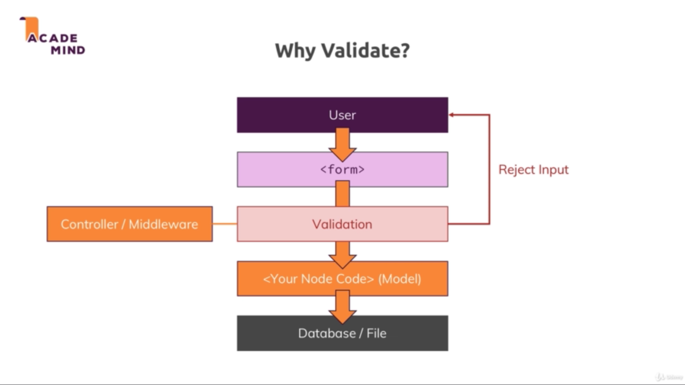

# Section 18. Understanding Validation

### lecture 285. Why Should We Use Validation?

앞서 작성한 회원가입 로직을 생각해보자
* 만약 관리자가 원하지 않는 유형의 이메일을 입력해서 가입을 신청했다면?
* 현재까지 작성한 코드만으로는 어떤 형식의 이메일이 유효하고 유효하지 않은지를 걸러낼 수 없다
* 상품도 마찬가지로 유저가 작성한 데이터를 어떤 식으로도 검증하고 있지 않다

밸리데이션
* 데이터베이스처럼 영구적인 저장소에 유저가 입력한 데이터를 바로 저장하지 않는다
* 그 이전에 밸리데이션 코드를 미들웨어나 컨트롤러에 작성해 검증을 거친 코드만 데이터베이스에 적용시킨다
* 밸리데이션을 통과하지 못한 코드는 이전 페이지나 특정 페이지로 에러메시지와 함께 리다이렉트 시킨다


---

### lecture 286. How to Validate Input?

밸리데이션 작성법
* 첫째로 유저가 입력한 폼을 클라이언트 사이드에서 자바스크립트 코드로 검증하는 방법이 있다
  - 서버로 보내기 전에 브라우저의 돔에 에러메시지를 보여준다
  - 물론 클라이언트 사이드에서도 밸리데이션을 작성하는 것은 UX의 관점에서 중요하다
  - 그러나 이는 어디까지나 클라이언트 사이드에서만 이루어지는 일이며 치명적인 결함을 발생시키지는 못한다(Optional)
* 서버 사이드에서 밸리데이션을 작성하기
  - 데이터베이스를 변경하는 등 크루셜한 영향을 끼치는 작업들이 많으므로 반드시 작성해야 한다
  - 어떤 데이터베이스는 빌트인 밸리데이션을 가지고 있기도 하다(ex. MongoDB)

---

### lecture 287. Setup & Basic Validation

회원가입 페이지부터 밸리데이션 추가하기
* express-validator 라이브러리를 활용해 밸리데이션을 작성할 것이다
* 설치하기
```terminal
$ npm i --save express-validator
```

라우터에 밸리데이션 로직 추가
```js
// routes/auth.js
(...)
const { check } = require('express-validator/check');
(...)
router.post('/signup', check('email').isEmail(), authController.postSignup);
(...)
```
* email이라는 name을 가진 입력필드를 찾아서 이메일인지 검증한다

에러발생시 컨트롤러에서 후처리하기
```js
// controllers/auth.js
(...)
const { validationResult } = require('express-validator/check');
(...)
exports.postSignup = (req, res, next) => {
  const email = req.body.email;
  const password = req.body.password;
  const confirmPassword = req.body.confirmPassword;
  const errors = validationResult(req);
  if (!errors.isEmpty()) {
    console.log(errors.array());
    return res.status(422).render('auth/signup', {
      path: '/signup',
      pageTitle: 'Signup',
      errorMessage: errors.array()
    });
  }
  User.findOne({ email: email })
    .then(userDoc => {
      if (userDoc) {
        req.flash(
          'error',
          'E-Mail exists already, please pick a different one.'
        );
        return res.redirect('/signup');
      }
      return bcrypt
        .hash(password, 12)
        .then(hashedPassword => {
          const user = new User({
            email: email,
            password: hashedPassword,
            cart: { items: [] }
          });
          return user.save();
        })
        .then(result => {
          res.redirect('/login');
          return transporter.sendMail({
            to: email,
            from: 'shop@node-complete.com',
            subject: 'Signup succeeded!',
            html: '<h1>You successfully signed up!</h1>'
          });
        })
        .catch(err => {
          console.log(err);
        });
    })
    .catch(err => {
      console.log(err);
    });
};
(...)
```
* 앞서 check에서 검증한 값에 문제가 있으면 validationResult에서 감지한다
* 만약 에러가 발생하면(에러가 비어있지 않으면 : !error.isEmpty()) 밸리데이션 실패 상태코드인 422와 함께 회원가입 페이지로 렌더링한다

---

### lecture 288. Using Validation Error Messages

밸리데이션을 통과하지 못했을 때 메시지 지정하기
```js
// controllers/auth.js
(...)
exports.postSignup = (req, res, next) => {
  const email = req.body.email;
  const password = req.body.password;
  const confirmPassword = req.body.confirmPassword;
  const errors = validationResult(req);
  if (!errors.isEmpty()) {
    console.log(errors.array());
    return res.status(422).render('auth/signup', {
      path: '/signup',
      pageTitle: 'Signup',
      errorMessage: errors.array()[0].msg
    });
  }
  User.findOne({ email: email })
    .then(userDoc => {
      if (userDoc) {
        req.flash(
          'error',
          'E-Mail exists already, please pick a different one.'
        );
        return res.redirect('/signup');
      }
      return bcrypt
        .hash(password, 12)
        .then(hashedPassword => {
          const user = new User({
            email: email,
            password: hashedPassword,
            cart: { items: [] }
          });
          return user.save();
        })
        .then(result => {
          res.redirect('/login');
          return transporter.sendMail({
            to: email,
            from: 'shop@node-complete.com',
            subject: 'Signup succeeded!',
            html: '<h1>You successfully signed up!</h1>'
          });
        })
        .catch(err => {
          console.log(err);
        });
    })
    .catch(err => {
      console.log(err);
    });
};
(...)
```

```js
// routes/auth.js
(...)
router.post(
  '/signup', 
  check('email')
    .isEmail()
    .withMessage('Please enter a valid email.'), 
  authController.postSignup
);
(...)
```

---

### lecture 289. Built-In & Custom Validators

커스텀 밸리데이션 추가하기
```js
// routes/auth.js
(...)
router.post(
  '/signup', 
  check('email')
    .isEmail()
    .withMessage('Please enter a valid email.')
    .custom((value, { req }) => {
      if (value === 'test@test.com') {
        throw new Error('This email address if forbidden.');
      }
      return true;
    }), 
  authController.postSignup
);
(...)
```
* custom 메서드에 콜백함수를 넘겨 체크 중인 값을 추가로 검증하는 커스텀 로직을 작성할 수 있다

---

### lecture 290. More Validators

패스워드 검증 추가하기
```js
// routes/auth.js
(...)
const { check, body } = require('express-validator/check');
(...)
router.post(
  '/signup', 
  [
    check('email')
    .isEmail()
    .withMessage('Please enter a valid email.')
    .custom((value, { req }) => {
      if (value === 'test@test.com') {
        throw new Error('This email address if forbidden.');
      }
      return true;
    }),
    body('password', 'Please enter a password with only numbers and text and least 5 characters.')
    .isLength({ min : 5 })
    .isAlphanumeric()
  ], 
  authController.postSignup
);
```
* 배열로 한 개의 컨트롤러에 여러 개의 밸리데이션을 지정할 수 있다
* header, cookie 등 모든 곳에서 값을 찾는 check과 달리 body는 req.body에서만 인자로 넘긴 값을 찾는다
* 두 번째 인자로는 검증에 실패했을 시 나타날 에러 메시지를 지정했다
* isLength의 인자로 최소값 혹은 최대값을 넘겨 길이를 지정할 수 있다
* isAlphanumeric은 영숫자로 된 조합인지를 체크한다

---

### lecture 291. Checking For Field Equality

패스워드 일치 검증하기
```js
// routes/auth.js
(...)
router.post(
  '/signup', 
  [
    check('email')
      .isEmail()
      .withMessage('Please enter a valid email.')
      .custom((value, { req }) => {
        if (value === 'test@test.com') {
          throw new Error('This email address if forbidden.');
        }
        return true;
      }),
    body('password', 'Please enter a password with only numbers and text and least 5 characters.')
      .isLength({ min : 5 })
      .isAlphanumeric(),
    body('confirmPassword')
      .custom((value, { req }) => {
        if (value !== req.body.password) {
          throw new Error('Password have to match!');
        }
        return true;
      })
  ], 
  authController.postSignup
);
(...)
```
* password와 confirmPassword가 불일치하면 에러를 발생시키는 밸리데이션을 추가했다

---

### lecture 292. Adding Async Validation

입력한 이메일이 이미 존재하는지 확인하기
* 지금까지는 컨트롤러에서 데이터베이스에 접근해 확인해왔다
  - 그러나 이제는 라우터 쪽에 작성된 밸리데이션 코드에 포함되는 것이 더 자연스럽다
```js
// routes/auth.js
(...)
router.post(
  '/signup', 
  [
    check('email')
      .isEmail()
      .withMessage('Please enter a valid email.')
      .custom((value, { req }) => {
        User
          .findOne({ email: email })
          .then(userDoc => {
            if (userDoc) {
              return Promise.reject('E-Mail exists already, please pick a different one.');
            }
          });
        // if (value === 'test@test.com') {
        //   throw new Error('This email address if forbidden.');
        // }
        // return true;
      }),
    body('password', 'Please enter a password with only numbers and text and least 5 characters.')
      .isLength({ min : 5 })
      .isAlphanumeric(),
    body('confirmPassword')
      .custom((value, { req }) => {
        if (value !== req.body.password) {
          throw new Error('Password have to match!');
        }
        return true;
      })
  ], 
  authController.postSignup
);
(...)
```
* 원래 컨트롤러에 있던 User.findOne({ email }) 코드를 밸리데이션 쪽으로 옮겼다
* user 다큐먼트가 있으면 Promise.reject로 에러 메시지를 비동기적으로 전달한다
* 그러면 express-validator가 인식해서 에러 메시지를 전달한다

```js
// controllers/auth.js
(...)
exports.postSignup = (req, res, next) => {
  const email = req.body.email;
  const password = req.body.password;
  const confirmPassword = req.body.confirmPassword;
  const errors = validationResult(req);
  if (!errors.isEmpty()) {
    console.log(errors.array());
    return res.status(422).render('auth/signup', {
      path: '/signup',
      pageTitle: 'Signup',
      errorMessage: errors.array()[0].msg
    });
  }
  
  bcrypt
    .hash(password, 12)
    .then(hashedPassword => {
      const user = new User({
        email: email,
        password: hashedPassword,
        cart: { items: [] }
      });
      return user.save();
    })
    .then(result => {
      res.redirect('/login');
      return transporter.sendMail({
        to: email,
        from: 'shop@node-complete.com',
        subject: 'Signup succeeded!',
        html: '<h1>You successfully signed up!</h1>'
      });
    })
    .catch(err => {
      console.log(err);
    });
};
(...)
```
* User.findOne 코드를 없앴다

---

### lecture 293. Keeping User Input

UX를 저해시키는 폼 제출 실패시 폼 비우기 수정하기
* 잘못된 입력이라도 이전 입력값을 폼에 유지시키는 것이 UX에 좋다

```js
// controllers/auth.js
(...)
exports.getLogin = (req, res, next) => {
  let message = req.flash('error');
  if (message.length > 0) {
    message = message[0];
  } else {
    message = null;
  }
  res.render('auth/login', {
    path: '/login',
    pageTitle: 'Login',
    errorMessage: message,
    oldInput: {
      email: '',
      password: ''
    }
  });
};

exports.getSignup = (req, res, next) => {
  let message = req.flash('error');
  if (message.length > 0) {
    message = message[0];
  } else {
    message = null;
  }
  res.render('auth/signup', {
    path: '/signup',
    pageTitle: 'Signup',
    errorMessage: message,
    oldInput: {
      email: '',
      password: '',
      confirmPassword: ''
    }
  });
};

exports.postLogin = (req, res, next) => {
  const email = req.body.email;
  const password = req.body.password;
  
  const errors = validationResult(req);
  if (!errors.isEmpty()) {
    return res.status(422).render('auth/login', {
      path: '/login',
      pageTitle: 'Login',
      errorMessage: errors.array()[0].msg,
      oldInput: { 
        email : email, 
        password : password 
      }
    });
  }
  User.findOne({ email: email })
    .then(user => {
      // if (!user) {
      //   req.flash('error', 'Invalid email or password.');
      //   return res.redirect('/login');
      // }
      bcrypt
        .compare(password, user.password)
        .then(doMatch => {
          if (doMatch) {
            req.session.isLoggedIn = true;
            req.session.user = user;
            return req.session.save(err => {
              console.log(err);
              res.redirect('/');
            });
          }
          req.flash('error', 'Invalid email or password.');
          res.redirect('/login');
        })
        .catch(err => {
          console.log(err);
          res.redirect('/login');
        });
    })
    .catch(err => console.log(err));
};

exports.postSignup = (req, res, next) => {
  const email = req.body.email;
  const password = req.body.password;
  const confirmPassword = req.body.confirmPassword;
  const errors = validationResult(req);
  if (!errors.isEmpty()) {
    console.log(errors.array());
    return res.status(422).render('auth/signup', {
      path: '/signup',
      pageTitle: 'Signup',
      errorMessage: errors.array()[0].msg,
      oldInput: { 
        email : email, 
        password : password, 
        confirmPassword : confirmPassword 
      }
    });
  }
  
  bcrypt
    .hash(password, 12)
    .then(hashedPassword => {
      const user = new User({
        email: email,
        password: hashedPassword,
        cart: { items: [] }
      });
      return user.save();
    })
    .then(result => {
      res.redirect('/login');
      return transporter.sendMail({
        to: email,
        from: 'shop@node-complete.com',
        subject: 'Signup succeeded!',
        html: '<h1>You successfully signed up!</h1>'
      });
    })
    .catch(err => {
      console.log(err);
    });
};
(...)
```

```html
<!-- views/auth/signup.ejs -->
<%- include('../includes/head.ejs') %>
    <link rel="stylesheet" href="/css/forms.css">
    <link rel="stylesheet" href="/css/auth.css">
</head>

<body>
   <%- include('../includes/navigation.ejs') %>

    <main>
        <% if (errorMessage) { %>
            <div class="user-message user-message--error"><%= errorMessage %></div>
        <% } %>
        <form class="login-form" action="/signup" method="POST" novalidate>
            <div class="form-control">
                <label for="email">E-Mail</label>
                <input type="email" name="email" id="email" value="<%= oldInput.email %>">
            </div>
            <div class="form-control">
                <label for="password">Password</label>
                <input type="password" name="password" id="password" value="<%= oldInput.password %>">
            </div>
            <div class="form-control">
                <label for="confirmPassword">Confirm Password</label>
                <input type="password" name="confirmPassword" id="confirmPassword" value="<%= oldInput.confirmPassword %>">
            </div>
            <input type="hidden" name="_csrf" value="<%= csrfToken %>">
            <button class="btn" type="submit">Signup</button>
        </form>
    </main>
<%- include('../includes/end.ejs') %>
```

```html
<!-- views/auth/login.ejs -->
<%- include('../includes/head.ejs') %>
    <link rel="stylesheet" href="/css/forms.css">
    <link rel="stylesheet" href="/css/auth.css">
</head>

<body>
   <%- include('../includes/navigation.ejs') %>

    <main>
        <% if (errorMessage) { %>
            <div class="user-message user-message--error"><%= errorMessage %></div>
        <% } %>
        <form class="login-form" action="/login" method="POST">
            <div class="form-control">
                <label for="email">E-Mail</label>
                <input type="email" name="email" id="email" value="<%= oldInput.email %>">
            </div>
            <div class="form-control">
                <label for="password">Password</label>
                <input type="password" name="password" id="password" value="<%= oldInput.password %>">
            </div>
            <input type="hidden" name="_csrf" value="<%= csrfToken %>">
            <button class="btn" type="submit">Login</button>
        </form>
        <div class="centered">
            <a href="/reset">Reset Password</a>
        </div>
    </main>
<%- include('../includes/end.ejs') %>
```

---

### lecture 294. Adding Conditional CSS Classes

밸리데이션 에러가 발생하면 해당 폼의 border를 빨간색으로 만들기

```js
// controllers/auth.js
(...)
exports.getSignup = (req, res, next) => {
  let message = req.flash('error');
  if (message.length > 0) {
    message = message[0];
  } else {
    message = null;
  }
  res.render('auth/signup', {
    path: '/signup',
    pageTitle: 'Signup',
    errorMessage: message,
    oldInput: {
      email: '',
      password: '',
      confirmPassword: ''
    },
    validationErrors: []
  });
};
(...)
exports.postSignup = (req, res, next) => {
  const email = req.body.email;
  const password = req.body.password;
  const confirmPassword = req.body.confirmPassword;
  const errors = validationResult(req);
  if (!errors.isEmpty()) {
    console.log(errors.array());
    return res.status(422).render('auth/signup', {
      path: '/signup',
      pageTitle: 'Signup',
      errorMessage: errors.array()[0].msg,
      oldInput: { 
        email : email, 
        password : password, 
        confirmPassword : confirmPassword,
      },
      validationErrors: errors.array()
    });
  }
  
  bcrypt
    .hash(password, 12)
    .then(hashedPassword => {
      const user = new User({
        email: email,
        password: hashedPassword,
        cart: { items: [] }
      });
      return user.save();
    })
    .then(result => {
      res.redirect('/login');
      return transporter.sendMail({
        to: email,
        from: 'shop@node-complete.com',
        subject: 'Signup succeeded!',
        html: '<h1>You successfully signed up!</h1>'
      });
    })
    .catch(err => {
      console.log(err);
    });
};
(...)
```

```html
<!-- views/auth/signup.ejs -->
<%- include('../includes/head.ejs') %>
    <link rel="stylesheet" href="/css/forms.css">
    <link rel="stylesheet" href="/css/auth.css">
</head>

<body>
   <%- include('../includes/navigation.ejs') %>

    <main>
        <% if (errorMessage) { %>
            <div class="user-message user-message--error"><%= errorMessage %></div>
        <% } %>
        <form class="login-form" action="/signup" method="POST" novalidate>
            <div class="form-control">
                <label for="email">E-Mail</label>
                <input 
                  class="<%= validationErrors.find(e => e.param === 'email') ? 'invalid' : '' %>"
                  type="email" 
                  name="email" 
                  id="email" 
                  value="<%= oldInput.email %>"
                />
            </div>
            <div class="form-control">
                <label for="password">Password</label>
                <input 
                  class="<%= validationErrors.find(e => e.param === 'password') ? 'invalid' : '' %>"
                  type="password" 
                  name="password" 
                  id="password" 
                  value="<%= oldInput.password %>"
                />
            </div>
            <div class="form-control">
                <label for="confirmPassword">Confirm Password</label>
                <input 
                  class="<%= validationErrors.find(e => e.param === 'confirmPassword') ? 'invalid' : '' %>"
                  type="password" 
                  name="confirmPassword" 
                  id="confirmPassword" 
                  value="<%= oldInput.confirmPassword %>"
                />
            </div>
            <input type="hidden" name="_csrf" value="<%= csrfToken %>">
            <button class="btn" type="submit">Signup</button>
        </form>
    </main>
<%- include('../includes/end.ejs') %>
```

---

### lecture 295. Adding Validation to Login

로그인 페이지도 이전에 입력한 폼을 유지하고 빨간색 보더 적용하기
```js
// controllers/auth.js
(...)
exports.getLogin = (req, res, next) => {
  let message = req.flash('error');
  if (message.length > 0) {
    message = message[0];
  } else {
    message = null;
  }
  res.render('auth/login', {
    path: '/login',
    pageTitle: 'Login',
    errorMessage: message,
    oldInput: {
      email: '',
      password: ''
    },
    validationErrors: []
  });
};
(...)
exports.postLogin = (req, res, next) => {
  const email = req.body.email;
  const password = req.body.password;
  
  const errors = validationResult(req);
  if (!errors.isEmpty()) {
    return res.status(422).render('auth/login', {
      path: '/login',
      pageTitle: 'Login',
      errorMessage: errors.array()[0].msg,
      oldInput: { 
        email : email, 
        password : password 
      },
      validationErrors: errors.array()
    });
  }
  User.findOne({ email: email })
    .then(user => {
      if (!user) {
        return res.status(422).render('auth/login', {
          path: '/login',
          pageTitle: 'Login',
          errorMessage: 'Invalid email or password.',
          oldInput: { 
            email : email, 
            password : password 
          },
          validationErrors: []
        });
      }
      bcrypt
        .compare(password, user.password)
        .then(doMatch => {
          if (doMatch) {
            req.session.isLoggedIn = true;
            req.session.user = user;
            return req.session.save(err => {
              console.log(err);
              res.redirect('/');
            });
          }
          return res.status(422).render('auth/login', {
            path: '/login',
            pageTitle: 'Login',
            errorMessage: 'Invalid email or password.',
            oldInput: { 
              email : email, 
              password : password 
            },
            validationErrors: []
          });
        })
        .catch(err => {
          console.log(err);
          res.redirect('/login');
        });
    })
    .catch(err => console.log(err));
};
(...)
```

```html
<!-- views/auth/login.ejs -->
<%- include('../includes/head.ejs') %>
    <link rel="stylesheet" href="/css/forms.css">
    <link rel="stylesheet" href="/css/auth.css">
</head>

<body>
   <%- include('../includes/navigation.ejs') %>

    <main>
        <% if (errorMessage) { %>
            <div class="user-message user-message--error"><%= errorMessage %></div>
        <% } %>
        <form class="login-form" action="/login" method="POST">
            <div class="form-control">
                <label for="email">E-Mail</label>
                <input 
                  class="<%= validationErrors.find(e => e.param === 'email') ? 'invalid' : '' %>"
                  type="email" 
                  name="email" 
                  id="email" 
                  value="<%= oldInput.email %>">
            </div>
            <div class="form-control">
                <label for="password">Password</label>
                <input 
                  class="<%= validationErrors.find(e => e.param === 'email') ? 'invalid' : '' %>"
                  type="password" 
                  name="password" 
                  id="password" 
                  value="<%= oldInput.password %>">
            </div>
            <input type="hidden" name="_csrf" value="<%= csrfToken %>">
            <button class="btn" type="submit">Login</button>
        </form>
        <div class="centered">
            <a href="/reset">Reset Password</a>
        </div>
    </main>
<%- include('../includes/end.ejs') %>
```

---

### lecture 296. Sanitizing Data

Sanitizing
* '위생적인'과 비슷한 의미다 
  - 구체적으로 어떤 것이 위생적이란 말인가?
  - 입력된 이메일은 항상 소문자인게 정상이다
  - 비밀번호나 이메일 모두 좌,우측에 빈칸이 없는게 정상이다

```js
// routes/auth.js
(...)
router.post(
  '/login', 
  [
    body('email')
    .isEmail()
    .withMessage('Please enter a valid email')
    .normalizeEmail()
    .custom((value, { req }) => {
      User.findOne({ email: req.body.email })
        .then(user => {
          if (!user) {
            return Promise.reject('Invalid email. Please check your email address.');
          }
        })
    }),
    body('password', 'Please enter a password with only numbers and text and least 5 characters.')
    .isLength({ min: 5 })
    .isAlphanumeric()
    .trim()
  ]
  ,
  authController.postLogin);
(...)
router.post(
  '/signup', 
  [
    check('email')
      .isEmail()
      .withMessage('Please enter a valid email.')
      .custom((value, { req }) => {
        User
          .findOne({ email: email })
          .then(userDoc => {
            if (userDoc) {
              return Promise.reject('E-Mail exists already, please pick a different one.');
            }
          });
        // if (value === 'test@test.com') {
        //   throw new Error('This email address if forbidden.');
        // }
        // return true;
      })
      .normalizeEmail(),
    body('password', 'Please enter a password with only numbers and text and least 5 characters.')
      .isLength({ min : 5 })
      .isAlphanumeric()
      .trim(),
    body('confirmPassword')
      .trim()
      .custom((value, { req }) => {
        if (value !== req.body.password) {
          throw new Error('Password have to match!');
        }
        return true;
      })
  ], 
  authController.postSignup
);
(...)
```
* normalizeEmail와 trim을 적용했다
* 자세한건 문서의 Sanitizing을 참조하자