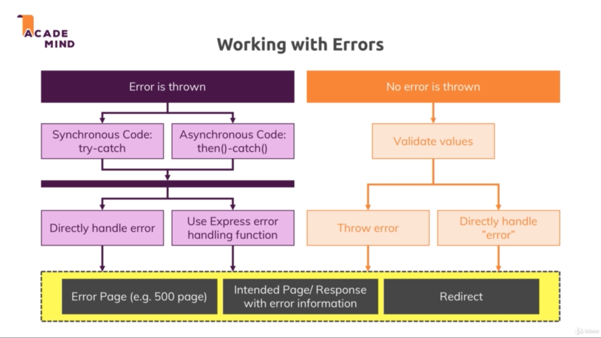

# Section 19. Error Handling

### lecture 302. Types of Errors & Error Handling

에러의 종류
* Technical/Network Errors
  - ex. 몽고디비 서버가 다운된 경우
  - 에러 페이지를 유저에게 보여준다
  - 발생한 에러 내용을 관리자에게 메일 등의 수단으로 알린다
* Expected Errors
  - ex. 파일을 읽을 수 없는 경우, 데이터베이스 동작이 실패한 경우
  - 유저에게 에러 발생 여부를 알리고 다시 시도할 것을 요청한다
* Bugs/Logical Errors
  - ex. 유저 객체가 없는데 사용한 경우
  - 개발 도중에 수리해야 한다

에러와 관련된 작업
* Error is thrown
  - 자바스크립트 자체의 에러 객체로 에러를 throw한 경우
  - ex. 유저 계정은 있으나 이메일이 입력되어 있지 않아 시나리오 상 에러가 발생한 경우
  - 기술적으로 심각한 에러가 아니므로 더 진행되도록 적절한 처리가 필요
* 동기적 코드
  - try-catch문으로 처리
* 비동기 코드
  - 대너블 체인-catch메서드로 처리
* 에러를 다루는 방법 채택하기
  - 동기, 비동기 어느 방식이든 에러를 직접 핸들링할지 익스프레스의 에러 핸들링 함수를 사용할 것인지를 선택해야 한다
* 에러가 발생하지 않았을 때
  - 값을 검증한다
  - 검증한 값이 잘못된 경우 에러를 발생시킨다(technical 에러인지 expected 에러인지 판단해서 재입력을 받을지 결정)
* 에러 처리 마무리 방법
  - 에러 페이지를 띄운다(ex. 500 page)
  - 에러 정보와 관련해 미리 준비한 페이지로 응답한다
  - 리다이렉트 한다



---

### lecture 304. Errors - Some Theory

두 변수를 더하는 간단한 함수를 작성하기
```js
const sum = (a, b) => {
  if (a && b) {
    return a + b;
  }
  throw new Error('Invalid value');
};

console.log(sum(1));
```
* a와 b가 존재하면 두 값을 더한 값을 리턴하는 함수다
* 그러나 하나의 값만 존재하지 않아도 에러를 발생시키고 이후의 로직들은 실행되지 않는다
* 서버를 운영할 때도 이렇게 에러를 던져버리면 이후의 어떤 처리도 불가능하다

동기적 코드를 try-catch문으로 에러 핸들링하기
```js
const sum = (a, b) => {
  if (a && b) {
    return a + b;
  }
  throw new Error('Invalid value');
};

try {
  console.log(sum(1));
} catch (err) {
  console.log('error ocurred');
}

console.log('after handling');
```
* 이러면 try-catch문 이후의 로직도 실행된다
* 에러가 발생한 뒤의 처리 코드는 catch블럭 안에 포함시켜 처리한다
  - 물론 어떤 상황이냐에 따라 처리 방법은 다를 수 있다
  - ex1. 에러 발생 페이지 렌더링
  - ex2. 재입력 요구
  - ex3. 리다이렉트

이후 강의들은 그다지 실용적이지 않다
* 일부러 에러를 발생시키고 try-catch문으로 감싸준 뒤 상태코드 500용 에러 페이지를 만들어 리다이렉트 해주는 내용이다

---

### lecture 307. Using the Express.js Error Handling Middleware

익스프레스의 에러 핸들링 미들웨어 사용하기
```js
(...)
catch (err) {
  const error = new Error(err);
  error.httpStatusCode = 500;
  return next(error);
}
```
* next에 인자로 에러를 넘기면 익스프레스는 다른 미들웨어들을 스킵한다
* 그리고 에러 핸들링용 미들웨어를 바로 실행한다

에러 핸들링용 미들웨어 작성하기
* 기존에 미들웨어를 작성할 때는 req, res, next만 인자에 작성했다
* req 앞에 error까지 작성하면 이를 에러 핸들링용 미들웨어로 사용할 수 있다
```js
(...)
app.use((error, req, res, next) => {
  // some error handling logic...
  res.redirect('/500');
});
(...)
```
* 여러 개의 에러 핸들링 미들웨어를 사용하려면 위에서 아래 순서로 작성한 뒤 next로 처리하면 된다

---