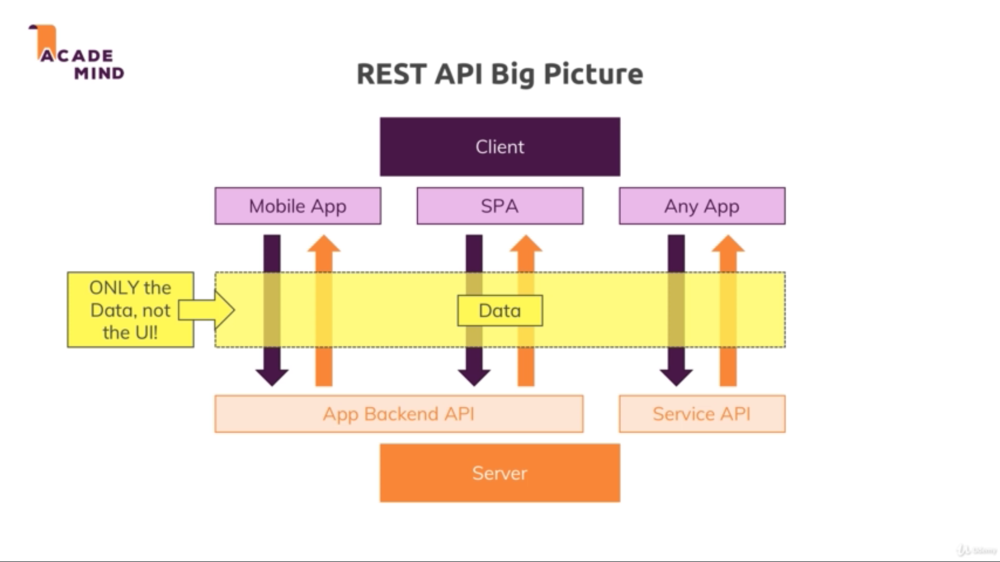
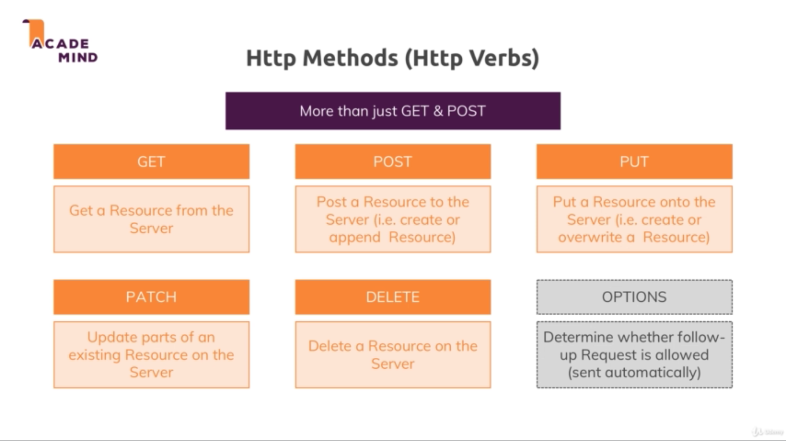

# Section 24. Working with REST APIs - The Basics

### lecture 355. What are REST APIs and why do we use them?

REST API가 필요한 이유
* 모든 프론트엔드 UI가 서버에서 생성된 HTML 페이지를 요구하지는 않는다
* 대표적으로 모바일앱은 서버에서 렌더링한 HTML 페이지가 필요없다
* 현재 대세인 SPA도 클라이언트 사이드에서 자바스크립트 코드로 API만 호출하는 방식으로 작업한다
* 구글맵스 같은 각종 서비스를 제공할 때도 API만 제공하는 것이 일반적이다

REST의 의미
* Representational State Transfer의 약자
* 이론적 내용을 걷어내고 핵심만 추려내면 유저 인터페이스 대신 데이터만 제공하는 것이라고 할 수 있다

---

### lecture 357. Accessing Data with REST APIs

한 눈에 보는 REST API
* 

REST API가 사용하는 데이터 포맷
* JSON
  - HTML처럼 데이터 외에 해석이 필요한 UI를 포함하고 있지 않다
  - 그렇다고 plain text처럼 해석하기 어렵게 아무런 구조도 없이 데이터가 주어지지도 않는다
  - plain text보다 기계가 해석하기 편하면서 데이터 자체에 집중할 수 있는 포맷이다

---

### lecture 358. Understanding Routing & HTTP Methods

API 엔드포인트
* REST API는 HTTP 메소드와 리소스 경로를 합친 API 엔드포인트 형식으로 서버와 클라이언트가 통신한다
  - ex. POST /post, GET /posts, GET /posts/:postId

여러 HTTP 메소드들
* 

---

### lecture 359. REST APIs - The Core Principles

Uniform Interface
* REST API는 API 엔드포인트를 명확하게 정의해야 하는 원칙이 있다(clearly defined)
* API를 사용하는 사람들은 엔드포인트만 보고도 어떤 데이터가 반환될 것인지 예측할 수 있어야 한다(predictable)

Stateless Interactions
* 서버와 클라이언트는 어떤 커넥션 히스토리도 저장해선 안된다
* 모든 요청은 분리된 요청이어야 한다

---

### lecture 360. Creating our REST API Project & Implementing the Route Setup

기본 설치
* npm init -y로 초기화
* express, body-parser, nodemon(dev)를 다운로드
* package.json의 scripts에 start로 nodemon app.js를 지정

app.js 초기화
```js
// app.js
const express = require('express');

const feedRoutes = require('./routes/feed');

const app = express();

app.use('/feed', feedRoutes);

app.listen(8080);
```
* /feed 이하의 리소스에 접근하는 경우 feedRoutes에서 처리하도록 지정
* 8080 포트에서 앱을 대기

feed 라우터 초기화
```js
// routes/feed.js
const express = require('express');

const feedController = require('../controllers/feed');

const router = express.Router();

router.get('/posts', feedController.getPosts);

module.exports = router;
```
* GET /feed/posts를 요청시 feed컨트롤러의 getPosts로 처리

---

### lecture 361. Sending Requests & Responses and Working with Postman

feed컨트롤러 작성하기
```js
// controllers/feed.js
exports.getPosts = (req, res, next) => {
  res.status(200).json({
    posts: [
      {title: 'First Post', content: 'This is the first post!'}
    ]
  });
};

exports.createPost = (req, res, next) => {
  const title = req.body.title;
  const content = req.body.content;

  // Create post in db
  res.status(201).json({
    message: 'Post created successfully!',
    post: { id: new Date().toISOString(), title: title, content: content }
  })
};
```
* res.json으로 응답하면 네트워크 탭을 통해 Content-Type헤더에서 application/json으로 응답하는 것을 확인할 수 있다
* createPost처럼 특정 데이터를 저장한 것이 성공했을 때는 201응답 코드를 보내주는 것이 더 좋다

body-parser 설정하기
* 앞서 뷰 페이지를 렌더링 할때는 x-www-form-urlencoded 형식의 데이터를 HTML form태그에서 받아왔다
* 그러나 REST API에서는 HTML form 데이터를 직접 필요로 하지 않는다
```js
// app.js
const express = require('express');
const bodyParser = require('body-parser');

const feedRoutes = require('./routes/feed');

const app = express();

// app.use(bodyParser.urlencoded()); // x-www-from-urlencoded <form>
app.use(bodyParser.json()); // application/json

app.use('/feed', feedRoutes);

app.listen(8080);
```

라우터에 createPost추가
```js
// routes/feed.js
(...)
router.post('/post', feedController.createPost);
(...)
```

Postman에서 테스트하기
* POST localhost:8080/feed/post로 엔드포인트를 지정한다
* Body에서 raw 라디오버튼을 체크한 뒤 text를 JSON으로 변경한다
```json
{
	"title": "Second Post",
	"content": "This is Second Post!"
}
```
* 위 데이터를 입력하고 요청을 보내면 다음 같은 응답이 올 것이다

```json
{
    "message": "Post created successfully!",
    "post": {
        "id": "2019-05-21T04:55:46.326Z",
        "title": "Second Post",
        "content": "This is Second Post!"
    }
}
```

---

### lecture 362. REST APIs, Clients & CORS Errors

간단한 클라이언트측 코드 작성하기
* 코드펜이나 로컬환경에서 작성하면 된다
  
```html
<button id="get">Get Posts</button>
<button id="post">Create Post</button>
```

```js
const getBtn = document.getElementById('get');
const postBtn = document.getElementById('post');

getBtn.addEventListener('click', () => {
  fetch('http://localhost:8080/feed/posts')
    .then(res => res.json())
    .then(resData => {
      console.log(resData);
    })
    .catch(err => console.log(err));
})
```
* get버튼을 클릭하면 CORS 정책을 위반했다는 에러가 뜨면서 요청이 실패한다

CORS
* Cross-Origin-Resource-Sharing의 약자
* 요청하는 클라이언트의 도메인과 응답하는 서버의 도메인이 다르면 에러가 발생한다

CORS해결하기
```js
// app.js
(...)
app.use((req, res, next) => {
  res.setHeader('Access-Control-Allow-Origin', '*');
  res.setHeader('Access-Control-Allow-Methods', 'GET, POST, PUT, PATCH, DELETE');
  res.setHeader('Access-Control-Allow-Headers', 'Content-Type, Authorization');
  next();
});
(...)
```
* Access-Control-Allow-Origin은 API 요청을 허가할 도메인을 지정하는 헤더다
  - 와일드카드(*)를 사용하면 어떤 도메인이든 요청이 가능하다
* Access-Control-Allow-Methods는 허용하는 HTTP 메소드를 지정하는 헤더다
* Access-Control-Allow-Headers는 사용자로부터 받을 헤더들을 지정하는 헤더다
* 이 미들웨어를 상위에 놓음으로써 CORS 문제를 해결할 수 있다

---

### lecture 363. Sending POST Requests

```js
postBtn.addEventListener('click', () => {
  fetch('http://localhost:8080/feed/post', {
    method: 'POST',
    headers: {
      'Content-Type': 'application/json' 
    },
    body: JSON.stringify({
      title: "Second Post",
      content: "This is Second Post" 
    })
  })
    .then(res => res.json())
    .then(resData => {
      console.log(resData);
    })
    .catch(err => console.log(err));
});
```
* HTTP 메소드가 GET이 아닐 때는 fetch API의 두번째 인자로 메소드와 기타 정보를 지정해야 한다

---