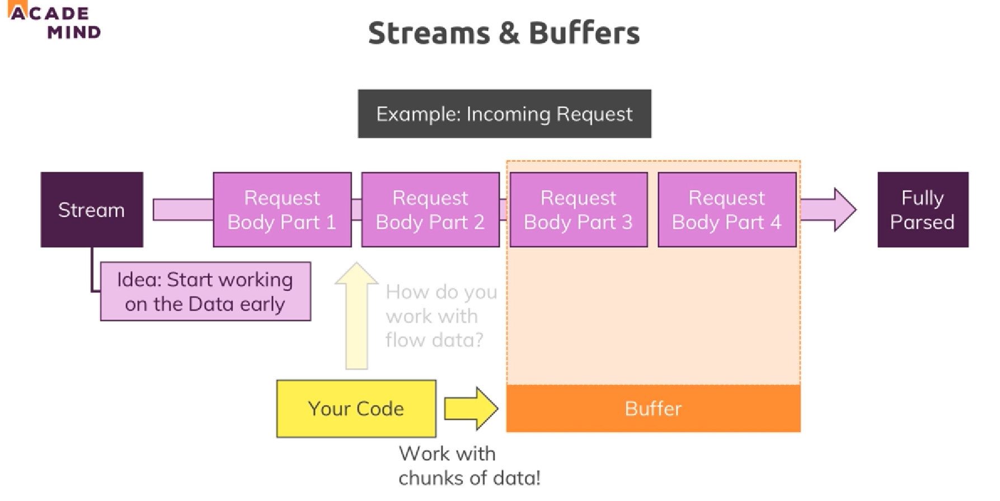

# Section 3. Understanding the Basics

### lecture 25. Creating a Node Server

서버를 만들기 위해 사용하는 모듈
* http
  - 서버를 런칭하고 요청을 보낼 수 있다
* https
  - SSL 서버를 런칭할 수 있다

http 모듈을 이용한 서버 만들기
* createServer 메서드를 이용해 http 서버를 만들 수 있다
  - createServer는 런칭한 서버에 들어오는 메시지를 캐칭할 request와 응답을 보낼 response를 인자로 가진다
* 생성한 http 서버에 listen 메서드를 이용하면 nodejs는 스크립트를 즉시 종료하지 않고 요청을 계속 대기한다
  - 첫번째 인자로 포트를 지정할 수 있다
```js
const http = require('http');

const server = http.createServer((req, res) => {
  console.log(req);
});

server.listen(3000);
```

---

### lecture 28. Understanding Requests

앞서 작성한 코드의 결과
* request와 관련된 수 많은 정보들이 출력된다
  - 이 모든 기능들을 자주 사용하는 것은 아니다
  - 요청과 관련해 주로 사용하는 세 기능이 있다
```js
const http = require('http');

const server = http.createServer((req, res) => {
  console.log(req.url, req.method, req.headers);
});

server.listen(3000);
```
* url은 host명 다음에 작성된 경로를 알려준다
* method는 어떤 http method를 사용했는지(GET, POST etc..) 알려준다
* headers는 요청에 연관된 부가정보들을 알려준다

---

### lecture 29. Sending Response

Response도 Request만큼 다양한 기능들을 가지고 있다
* 마찬가지로 평소에 모든 기능을 활용하는 것은 아니다
  - 대표적인 기능들을 세 가지만 살펴본다
```js
const http = require('http');

const server = http.createServer((req, res) => {
  // console.log(req.url, req.method, req.headers);
  res.setHeader('Content-Type', 'text/html');
  res.write('<html>');
  res.write('<head><title>My First Page</title></head>');
  res.write('<body><h1>Hello from my Node.js Server!</h1></body>');
  res.write('</html>');
  res.end();
});

server.listen(3000);
```
* setHeader는 응답 헤더로 보낼 내용을 지정할 수 있게 해준다
* write로 응답으로 보낼 텍스트를 작성할 수 있다
* end는 응답을 마칠 때 사용한다

---

### lecture 31. Routing Requests

앞서 작성한 서버의 문제점
* 다양한 경로에 대한 접근에 똑같이 응답하고 있다
  - 사용자의 접근 경로마다 다른 결과를 응답하는 작업인 라우팅이 필요하다
  - request의 url을 파싱해서 분기하는 것으로 해결할 수 있다
```js
const http = require('http');

const server = http.createServer((req, res) => {
  const url = req.url;
  if (url === '/') {
    res.write('<html>');
    res.write('<head><title>Enter Message</title></head>');
    res.write('<body><form action="/message" method="POST"><input type="text" name="message"/>></form></body>');
    res.write('</html>');
    return res.end();  
  }
  res.setHeader('Content-Type', 'text/html');
  res.write('<html>');
  res.write('<head><title>My First Page</title></head>');
  res.write('<body><h1>Hello from my Node.js Server!</h1></body>');
  res.write('</html>');
  res.end();
});

server.listen(3000);
```
* 분기해서 처리한 응답은 return해줘야 한다
  - 그렇지 않으면 다음 코드들이 실행되면서 에러를 발생시킨다
  - 예를 들어 위 코드에서는 응답을 완료(end)한 다음에 setHeader로 클라이언트에게 다시 응답을 작성하려 했기 때문에 에러가 발생한다(ERR_HTTP_HEADERS_SENT)

---

### lecture 32. Redirecting Requests

특정 경로에 접속하면 다른 경로로 이동하게끔 만들기
```js
const http = require('http');
const fs = require('fs');

const server = http.createServer((req, res) => {
  const url = req.url;
  const method = req.method;
  if (url === '/') {
    res.write('<html>');
    res.write('<head><title>Enter Message</title></head>');
    res.write('<body><form action="/message" method="POST"><input type="text" name="message"/><input type="submit"/></form></body>');
    res.write('</html>');
    return res.end();  
  }
  if (url === '/message' && method === 'POST') {
    fs.writeFileSync('message.txt', 'DUMMY');
    res.statusCode = 302;
    res.setHeader('Location', '/');
    return res.end();  
  }
  res.setHeader('Content-Type', 'text/html');
  res.write('<html>');
  res.write('<head><title>My First Page</title></head>');
  res.write('<body><h1>Hello from my Node.js Server!</h1></body>');
  res.write('</html>');
  res.end();
});

server.listen(3000);
```
* / 경로에서 폼을 제출하면 POST 메소드로 /meesage 경로로 접속한다
* 그러면 두 번째 분기문이 실행된다
  - message.txt라는 파일을 DUMMY라는 텍스트를 작성해 생성한다
  - statusCode는 응답 코드를 지정하는 프로퍼티다
  - setHeader의 Location에 리다이렉팅할 경로를 지정한다

---

### lecture 33. Parsing Request Bodies

요청의 body를 파싱하기
* 앞서 url과 method 그리고 headers 같은 정보를 request에서 추출했다
* 연관해서 생각해보면 요청에 body가 있을 때 request.data 같은 프로퍼티로 접근하면 될 것 같지만 안된다
* 대신 Node.js는 스트림의 형태로 데이터를 받아온다
  - 스트림은 계속 이어지는 작업이다
  - 요청의 body는 여러 부분으로 나뉘어 전달된다(나뉘어진 데이터들을 청크chunk라고 한다)
  - 모든 청크들이 전송되면 데이터를 사용할 수 있다
  - 그런데 현실에서는 모든 청크들이 전송될 때까지 기다리지 않고 중간에 데이터에 접근하고 싶은 요구사항이 있을 수 있다
  - 어떻게 흐르는 데이터들에 접근해서 조작을 가할 수 있을까?
* buffer 사용하기
  - 버퍼는 일종의 버스정류장 같은 개념이다
  - 버스는 드라이빙 하는 도중에 승객을 태우거나 내리기 위해 버스 정류장을 필요로 한다
  - 버퍼는 여러 청크들을 홀딩해주는 구조다 



```js
const http = require('http');
const fs = require('fs');

const server = http.createServer((req, res) => {
  const url = req.url;
  const method = req.method;
  if (url === '/') {
    res.write('<html>');
    res.write('<head><title>Enter Message</title></head>');
    res.write('<body><form action="/message" method="POST"><input type="text" name="message"/><input type="submit"/></form></body>');
    res.write('</html>');
    return res.end();  
  }
  if (url === '/message' && method === 'POST') {
    const body = [];
    req.on('data', chunk => {
      console.log(chunk);
      body.push(chunk);
    });
    return req.on('end', _ => {
      const parsedBody = Buffer.concat(body).toString();
      const message = parsedBody.split('=')[1];
      fs.writeFileSync('message.txt', message);
      res.statusCode = 302;
      res.setHeader('Location', '/');
      return res.end(); 
    }); 
  }
  res.setHeader('Content-Type', 'text/html');
  res.write('<html>');
  res.write('<head><title>My First Page</title></head>');
  res.write('<body><h1>Hello from my Node.js Server!</h1></body>');
  res.write('</html>');
  res.end();
});

server.listen(3000);
```