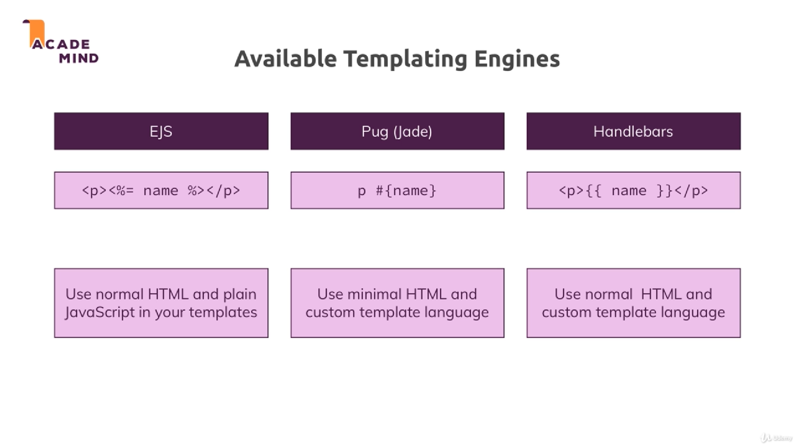

# Section6. Working with Dynamic Content & Adding Templating Engines

### lecture 77. Sharing Data Across Requests & Users

요청 간 데이터 공유
* 이 섹션에서는 데이터베이스를 이용해 영구적으로 저장하지는 않는다
* 코드는 이전 섹션에서 작성했던 것을 베이스로 한다
* admin 라우터 파일에 데이터를 저장할 배열을 만들고 입력받은 데이터를 공유하기 위해 노출한다

```js
// routes/admin.js
const express = require('express');
const path = require('path');

const rootDir = require('../util/path');
const router = express.Router();

const products = [];

router.get('/add-product', (req, res, next) => {
  res.sendFile(path.join(rootDir, 'views', 'add-product.html'));
});

router.post('/add-product', (req, res, next) => {
  products.push({ title : req.body.title });
  res.redirect('/');
});

exports.routes = router;
exports.products = products;

// app.js
(...)
const adminData = require('./routes/admin');
(...)
app.use('/admin', adminData.routes);

// routes/shop.js
const express = require('express');
const path = require('path');

const rootDir = require('../util/path');
const router = express.Router();
const adminData = require('./admin');

router.get('/', (req, res, next) => {
  console.log(adminData.products);
  res.sendFile(path.join(rootDir, 'views', 'shop.html'));
});

module.exports = router;
```
* app.js에서 adminRoutes를 adminData로 바꾸고 미들웨어에서 routes 프로퍼티를 지정하게 변경한다
* / 경로로 접근시 products를 출력하도록 shop.js를 수정했다
* 상품을 추가하면 / 경로로 리다이렉트 되면서 콘솔에 출력되는 것을 확인할 수 있다

위와 같은 코드에서 발생할 수 있는 문제
* 다른 브라우저에서 /경로로 접속해보면 앞서 입력했던 products가 그대로 콘솔에 출력된다
* 모든 유저들에게 공유해야 하는 데이터라면 상관없겠지만 현실에서는 유저별로 요청을 받아 데이터를 다루는 경우가 많다
* 따라서 실제 서비스에서는 데이터베이스를 이용해 유저별로 데이터를 관리해야 한다
* 여기서는 개념을 설명하기 위해 대략적인 방법만을 다룬 것이다

---

### lecture 78. Templating Engines - Overview

템플릿 엔진
* HTMLish한 view를 사용할 수 있다
  - 기본적으로 HTML과 같은 기능을 한다
  - 그런데 Node/Express 앱에서 보낸 데이터(ex. 위 코드의 products)를 다룰 수 있다
  - 동적으로 여러 HTML 코드를 불러와서 조합한 화면을 보여줄 수 있다

Node진영에서 자주 사용하는 템플릿 엔진
* EJS
* Pug(Jade)
* Handlebars
* 서로 다른 철학과 문법을 가지고 있다. 특징은 아래 사진과 같다



---

### lecture 79. Installing & Implementing Pug

앞서 설명한 3개의 템플릿 엔진 다운로드
```terminal
$ npm i --save ejs pug express-handlebars
```
* handlebars는 express에서 사용할 경우 전용 패키지를 사용해야 한다

템플릿 엔진 사용하기
* 템플릿 엔진을 사용하려면 express에 특정 템플릿 엔진을 사용할 것이라 알려야 한다
* 이 때 set메서드를 사용한다
  - set은 key - value 형식으로 특정 값을 익스프레스 앱 전체에 공유가능하도록 글로벌하게 설정한다
  - 템플릿 엔진을 지정하기 위한 key로는 view engine이 사용된다
  - 템플릿 파일이 위치할 곳은 views를 key로 설정하는 데 기본 value는 views다
* pug를 등록하기
```js
// app.js
(...)
app.set('view engine', 'pug');
app.set('views', 'views');
(...)
```

pug를 이용해 shop.html을 구현하기
```pug
<!DOCTYPE html>
html(lang="en")
  head
    meta(charset="UTF-8")
    meta(name="viewport", content="width=device-width, initial-scale=1.0")
    meta(http-equiv="X-UA-Compatible", content="ie=edge")
    title My Shop
    link(rel="stylesheet", href="/css/main.css")
    link(rel="stylesheet", href="/css/product.css")
  body
    header.main-header
      nav.main-header__nav
        ul.main-header__item-list
          li.main-header__item
            a.active(href="/") Shop
          li.main-header__item
            a(href="/admin/add-product") Add Product
```
* main 부분은 아직 구현하지 않았다

```js
// routes/shop.js
router.get('/', (req, res, next) => {
  res.render('shop');
});
```
* 템플릿 엔진을 사용하면 express에서 제공하는 render 메서드를 통해 파일을 제공할 수 있다
* 확장자를 붙이지 않아도 자동으로 처리해준다

---

### lecture 80. Outputting Dynamic Content

지금까지 작성한 템플릿 엔진 코드
* pug를 이용해 보다 간단하게 html을 작성했다
* 하지만 동적으로 express로부터 받은 데이터를 활용하지는 않았다
* res.render의 두 번째 인자로 자바스크립트 object를 넘겨서 동적인 작업을 추가해보자

```js
// routes/shop.js
(...)
router.get('/', (req, res, next) => {
  const products = adminData.products;
  res.render('shop', { prods: products, docTitle: 'Shop'});
});
(...)
```
* products를 받아와서 prods라는 이름으로 shop.pug에 데이터를 넘겨주고 있다
* 동시에 Shop이라는 문자열을 docTitle로 넘겨주고 있다
* 이렇게 넘겨준 데이터를 어떻게 처리하는지 보자

```pug
// shop.pug
<!DOCTYPE html>
html(lang="en")
  head
    meta(charset="UTF-8")
    meta(name="viewport", content="width=device-width, initial-scale=1.0")
    meta(http-equiv="X-UA-Compatible", content="ie=edge")
    title #{docTitle}
    link(rel="stylesheet", href="/css/main.css")
    link(rel="stylesheet", href="/css/product.css")
  body
    header.main-header
      nav.main-header__nav
        ul.main-header__item-list
          li.main-header__item
            a.active(href="/") Shop
          li.main-header__item
            a(href="/admin/add-product") Add Product
    
    main
      if prods.length > 0
        .grid
            each product in prods
                article.card.product-item
                    header.card__header
                        h1.product__title #{product.title}
                    div.card__image
                        img(src="data:image/jpeg;base64,/9j/4AAQSkZJRgABAQAAAQABAAD/2wCEAAkGBw8PDw8NDQ0NDQ0NDQ0NDQ0NDw8NDQ0NFREWFhURFRUYHSggGBolGxUVITEhJSkrLi4uFx8zODMtNygtLisBCgoKDg0OFQ8QFSsdFR0uLSsrKy0rKy0tKy0tKysrMCstLS0rLS0rLSstKy0rLS0rLTctLS0tLTctKy0tLTc3K//AABEIALsBDQMBIgACEQEDEQH/xAAcAAACAgMBAQAAAAAAAAAAAAABAgADBQYHBAj/xABJEAACAQIBBA0JBQYEBwAAAAAAAQIDEQQFEiExBgcTQVFSU3GBkZLB0SIyVGGCk6Gx0hQVFnLCF0SDorLhYmOj8CMkNEJDc8P/xAAYAQEBAQEBAAAAAAAAAAAAAAAAAQIDBP/EACkRAQEAAgEDAwMDBQAAAAAAAAABAhESAzFRMkFhInGxIYHBIzNCkfD/2gAMAwEAAhEDEQA/AOjoZCoY0CggQQCG64UVx06bD2OXNrRk1woOcuFdYqQbDnU0bOXCHOXCLYlhzq6PnLhJnLhQtiWHOmj39YSpoDXBo5hz+DS4hRukl6+caNdPQ9D+BqZyppaQjZU663tPNqLbIi0hTurfAviS74fkZ5xdLiFOnhfWSz4X1sc/hdLgFNvW+tgs+F9bHP4NLiFGnhfWC74WOaaXgKc+XD8EDdJcPwHOHFcKVKvZpSsk9F9WktuamUpZoGBhYDSFYGMwAKhkKhkAUCcrJ9XXoNO2zst4jB4ajLCVdxnVxG5ykowlLMzJPRnJ20pFmw+WIlRoVcViquJqV4wrPPsowTWcoqKS638DnlnpudP6eW23Q1dY6FhqHRiJUCKQ1pNmuG4gUXRs9yXAiWGjYisIGTRskkVSiWyEJYsquKk5NOTcVGNo6LJ3enh4OoujEEV5T/LH5ssMYtVEgihR00xswRQ2GjY2A0QA0bBoDIwDRsGhWhgMmleXFrRfgkmeZ4iVKTa0xb0x3uf1M9uJXksx+LV9Pqv8Dnf0u41OzC4rZ7CjXhQr4DF0t0qRpxqt0pU3nOyaadn8zcTme2HG2EjVWujiKdRc9pLvOk0J50VJapJNczR26eVu9r1MZJLIdijMDOjkrQwEEDmu3LVVsDSbspVK83v2SUFf+Y2/INFQp4eC0qFGnG+q9qdjRNt95+LwdFNJ7hNpvUnOpZN9k6Nk+NmlxY6OhWOGfd6L+mGP7/llIjAQTUcKBCERpBCkAYA2AEAEAwisBJCoZiolDR85/lXzZYJHzn+VfNjmMWqBAkubZQKAQoYDIQBWAZisgAGEjJViqqtD5mY+utC5kZKSMfUXkrp+ZitRqOzyjnZPrrfi6UuhVI3+Fzb9jmI3XB4Wpx8LQl0umjX9lNPOwWLW/wDZ6slzxi33GQ2v6udkzBvi0czsSlHuL0+9dM/7c+7YWAIDu4EQRUEDk+z+DrZbw9JabUsLB6baN0nJ/BnTcD5z5u9HLsuPddkmbrUK2ES9inCfzudTyetfs95wrv1O2P2j3hAE1HECEIaQQoCGKgohEQACsYVhSMCCxUQWR85/lXzYzFjr9lfMZmMWqFwEIbZEZChRUFBAghSsVjMSRBAEISrCs8VRaH6pNHtZ5Kq87nv1mK1GJyjSz6dWHHp1I9cWjxbVVXOyZTW/CrXjzXm5fqMrNaTA7VMs2jjKHI4+quhwiv0sYep079O/efy3lgCA7uCpBAggciwEt12RVprVDFYqL/h05w+cTq+T1ofOjlGwWq6mVcVNebOWLqvfemto/qOs4BeT0v5I4+P+93frerXjX4j1BAE04IQBDQKHEQwQUQBAIxWEDAVioMhUSqujr9nvIwR1+z3hZjFaBCEOiChhUS4QyCBMICsSQ7EkFKmERDGasBnlrLTLoZ6meatrf5GZqvDPWa3tfPMxuV6O8sRSqL2pVb/pNkqa/wDfCazsXeZlvKFPlsPSrJflzF+tkx9UdMfTlPj+Y38UIDs4qha9TNhKW9CMpdSuMjG7Ja+54HGVFrhhMQ1z7m7Ak25rtU0/+LXnraoQjd6/Kkn+k63gfMXT8zmW1fRShiJK+c3Si+LmrOtb4/A6dhPMXN82cvDv1r9eT0EAE04IQBDQZBAiBBIQjAFwNkYLgLICJJgQVdHX7PeRsEdfs95GYxWoEAbm2UCC5EASEBcAiSDcWQUgwgyJRGUVta9aaL2U1v8At5zFaY6r4mr4V5myCD3q+AnHnabf/wAzaK+vpNUyo8zLOS6nH3anz+RJW/nJ7x06fvPiuiChQDu4qka/s/q5uTMW72zqcafbnGPeZ9Gp7aFS2TpRvbdMRh489pZ/6TOXat9Obzx+7EbWdO2GrS42Jt0KEfFnRsP5q/LH5Gi7AKThgabatn1KlTnV7J9SN8p6uhIwud+qnCAhXMQEIaQyIAIBRGREYCsW4WKwBMWLCxUFXx19DIwQ19DI2YxWiQBDbIjICIASMBGwALIIrAQZCMZEqiU19S9TTLSqv5rM1pj8VrfOahsv8jE5KrcTHU4X4FKcL/CJuGL1s07bD0YWlW36GKpVV0X/ALGK69L1R0ZEFpyuk956Qs9DgqRo+2zUthcPDjYnO6I05fUbujnG25V8rB0/8OJm+uml3mM+1dehP6kZzYbC2Cwy4abfQ5NpfE3KJq+xqnm4bCQetYegnzuMb/M2dEvesW7MEVBKyIRQlDEAghBIAgEZXIsYkgqtgRJATILoPT0MIsXpXMwmcVpiACbQUQhAggZCAARjNiNhSMZCMZGaCV1dT5h7iy3yNMfid71xXyNV2eUs/J9ZcV05fzpG04jVHmt8TBbJIZ2CxMdf/Bm+pX7jFbwuspWy5Fr7phsPU5TD0Z9cE+89jMHsJrZ+TsG+DD04dhZv6TOHeOeU1bFCZy/bRqqWNoU3e0MPBu2u06s729doHTzk+z21TKsYa9GFo259P6yZfrqOvR9VviV0bJsLbnFaoxgkuBJf2MymYvBef/vgZk0zEc6dBEQ6KyZEBciZQ6IKmNcAkAQCMSQzEYCSEHkIRVkXpXMxyqL0rmY6ZIU4UKE0hgi3CBGxWwsVgBsRjMVgKyEIRUuBsDA2RXhxHm8zkviYvHwzqNWHGp1I9cWZXEapfnfyMfLfM1Y821lVzsm0VxKmIjp/90pL4SRtTNK2rZWw2IpcjjasFzZkP7m6XOuPaHU9dee5yrKEFVy7PTqxdF6P8uEF+k6pc5Pkas55ZqS4+Jxun/CpSa+CM5+2m+j/AJX4dQwPndfyMhcx2B1vmfcZC5I506YyZUmMmVD3DcS4bhD3DcRMNwHuG4lyXAZsVsDYjYVJFbZJSK2yC2L0rmfcWJlEHpXMyxSJFXJkuVpjJmkPcNxLkuA1wNi3BcAtgYGwNgFisjYtwCxWRsVsivNiVol0MxknpMniN/8ALfqZiqj0mVjFbX0s3EZTo8GKjVt6puf0o3e5oWxOWZlbKEOUpUai9drfWb3c6Y9l6vq/1+HnvvnJthF6mPlVte0K021qUpP+7OnZSr7nQrVOTo1Z9mDfccx2A4mlRdepWq06aUaUFKpOMU7Xb1kzutNdOfTl+zqWDlZNvQkrt7yRdLKFBa69Fc9SC7zn+XdleFzYxo4tSd/LVKeanG2pvUzWK2X4OTaxMkt5Os9Bjd9oxp2ZZSw/pFH3kPEZZSocvS7cTiUst09/E39ub7yqWWqO/Wv0TY3l4NR3L7zocvT7SA8r4Za8RS7RwmWWsPx5PmpvvQv35h+Co/ZSLvI1HdnlzCLXiaXaB+IMH6VR7Rwd7IKO9TqvqXeB7IaXJVeteI+o1HevxBg/S6PaCsvYP0uh20cEWyGnyFTrQfxBD0ep1ofUad8WWMK9WKw7/iw8SyOMpS82rSl+WcX3nAPv6Po9X4BWWov93q9cfEbq8L4fQDfBpKpSOExy/uelRr09emM7PRbgfrPbT2a16fmYup7dWNVdTuTZwrtUJ6V0likciobZtSMGpyozqW8l7lUS9d7WXUip7YWIqa6+bfepblH+pJklXhXZose5w2rsrq1M5KrjpyV72nNpW16FJJ9B5llqbvn0sVU1a1b5ydze04V3l1YrXKK52kJLF0lrq01zzj4nBnliPotbpzPEn3sr2+x1r80PEbOF8O7PH0eXo+8h4ivKFDl6PvIeJwuOV09WEq2/h+JFlqPotX/T8Rs4Xw7n9vo8vS95HxB9uo8tS7cfE4d99xvb7LUvq10/EP36l+7Vf9PxGzhfDt/26jy1Ltx8QPHUeWpduPicSWyBej1eun4jrZHwUK3XT8Rs4Xw7S8dR5al24+Irx9HlqXbj4nGVsoa/8Vbrp+Iy2WS5Kr0un4k2vC+HYJYiE35E4TtGSeZJStwXtzGNqvScyjsxnHTGNaL06VKmn13PVh9n0lZVKMprjOUIyt16SLwy8NlyZLMy5blsDLpalH6Wb9c5LkjL0MVlfBVKcJQajWpTTcZZy3ObVrdJ1dM3h2TqzVn2ePFUI1ac6U75lSE6cknZ5sk0/gzUntc4PlMUvbhq7JuKIbslYmVnatLntaYKWupie1B/pKv2XYLlcT2ofSb0FE1Dlb7tFW1fguVxPah9JFtYYHlMR2ofSb2SxdROV8tFW1lgeUxHah9Iy2tMDx8R2qf0m7hQ1DlfLSltaYHj4jtQ+kZbW2C4+I7UPpN0GQ1DlfLS/wBm2B42I7UPpD+zfBcfEduP0m6EQ1Dll5aZ+zfBcfEduPgH9m2C4+I7cfA3Qg1DlfLS1tbYDfliGt9borP4Fq2t8l8hUfrdapf5m4EGocr5amtrvJVv+k6d1rX/AKiyO1/ktX/5TX/m1mlo3vKNoINJyvlrC2A5NvdYdresqtVL5jrYNk70Z9NWr9RsxGNRd3y1lbB8m+ir3lX6hlsKyav3SPbqeJsbANQ3fLX1sMyd6HT7U/EK2HZO9Co/zPvM+yA3WDWxPJ9rfYqHZuT8KZP9Bw/u0ZtgYN1hvwvk/wBBw3uoh/DGA9BwvuoeBl2AG6xS2OYFfuWF9zT8A/h/BehYX3NPwMoAJtjvuTCb2Ew3uafgBZGwu9hcP7mn4GQIB5sPgKNN50KNKD4YQjF9aR67gAB//9k=", alt="A Book")
                    div.card__content
                        h2.product__price $19.99
                        p.product__description A very interesting book about so many even more interesting things!
                    .card__actions
                        button.btn Add to Cart
      else
        h1 No Products
```
* html 코드가 보다 간결해졌고 마치 일반 프로그래밍 코드처럼 변수를 사용하면서 조건에 따른 분기가 가능해졌다
* #{[key]} 형태로 동적으로 데이터를 다룰 수 있다
* 더 많은 pug 템플릿 엔진의 기능은 pug docs를 살펴보자
  - [Official Pug Docs](https://pugjs.org/api/getting-started.html)

---

### lecture 82. Converting HTML Files to Pug

add-product와 404 페이지를 pug로 변경하기
* 먼저 라우터쪽에서 pug로 작성된 템플릿을 렌더링하도록 코드를 변경한다
* 그리고 pug 파일을 작성한다

```js
// admin.js
(...)
router.get('/add-product', (req, res, next) => {
  res.render('add-product', { pageTitle: 'Add Product'});
});
(...)

// app.js
(...)
app.use((req, res, next) => {
  res.status(404).render('404');
});
(...)
```

```pug
// add-product.pug
<!DOCTYPE html>
html(lang="en")
  head
    meta(charset="UTF-8")
    meta(name="viewport", content="width=device-width, initial-scale=1.0")
    meta(http-equiv="X-UA-Compatible", content="ie=edge")
    title #{pageTitle}
    link(rel="stylesheet", href="/css/main.css")
    link(rel="stylesheet", href="/css/forms.css")
    link(rel="stylesheet", href="/css/product.css")
  body
    header.main-header
      nav.main-header__nav
        ul.main-header__item-list
          li.main-header__item
            a.active(href="/") Shop
          li.main-header__item
            a(href="/admin/add-product") Add Product
    
    main
      form.product-form(action="/admin/add-product", method="POST")
        .form-control
          .label(for="title") Title
          input(type="text", name="title", id="title")
        button.btn(type="submit") Add Product

// 404.pug
<!DOCTYPE html>
html(lang="en")
  head
    meta(charset="UTF-8")
    meta(name="viewport", content="width=device-width, initial-scale=1.0")
    meta(http-equiv="X-UA-Compatible", content="ie=edge")
    title Page Not Found
    link(rel="stylesheet", href="/css/main.css")
  body
    header.main-header
      nav.main-header__nav
        ul.main-header__item-list
          li.main-header__item
            a.active(href="/") Shop
          li.main-header__item
            a(href="/admin/add-product") Add Product
    h1 Page Not Found!
```

---

### lecture 83. Adding a Layout

앞서 작성한 템플릿 코드들의 문제점
* header와 관련된 코드들이 여러곳에 반복해서 등장한다
* 이를 하나의 파일로 분리해 불러오는 방식으로 사용하면 중복을 줄일 수 있다
  - 이런 작업을 Layout이라 한다

```pug
// layouts/main-layout.pug
<!DOCTYPE html>
html(lang="en")
  head
    meta(charset="UTF-8")
    meta(name="viewport", content="width=device-width, initial-scale=1.0")
    meta(http-equiv="X-UA-Compatible", content="ie=edge")
    title Page Not Found
    link(rel="stylesheet", href="/css/main.css")
    block styles
  body
    header.main-header
      nav.main-header__nav
        ul.main-header__item-list
          li.main-header__item
            a(href="/") Shop
          li.main-header__item
            a(href="/admin/add-product") Add Product
    block content

// 404.pug
extends layouts/main-layout.pug

block content
  h1 Page Not Found!

// add-product.pug
extends layouts/main-layout.pug

block styles
  link(rel="stylesheet", href="/css/forms.css")
  link(rel="stylesheet", href="/css/product.css")
    
block content    
  main
    form.product-form(action="/admin/add-product", method="POST")
      .form-control
        .label(for="title") Title
        input(type="text", name="title", id="title")
      button.btn(type="submit") Add Product
```
* body 이전 까지의 코드를 styles로 이후 코드를 content로 블록을 나눴다
* 위 코드를 다른 템플릿 파일에서 그대로 사용하려면 extends 예약어를 통해 파일을 불러온 뒤 block 명을 지정하면 된다
* 문제는 content 블록의 a태그에 active 클래스를 shop과 add-product파일마다 다르게 적용해야 한다

---

### lecture 84. Finishing the Pug Template

layout에 동적으로 다른 클래스 추가하기
* 경로가 / 일때는 Shop 앵커에 색을 /admin/add-product 일때는 Add Product 앵커에 색을 입힐 것이다
* render 메서드에 path로 경로를 지정한다
* 그리고 layout 파일에서 삼항식을 이용해 동적으로 클래스를 지정한다

```js
// routes/admin.js
router.get('/add-product', (req, res, next) => {
  res.render('add-product', { pageTitle: 'Add Product', path: '/admin/add-product' });
});

// routes/shop.js
router.get('/', (req, res, next) => {
  const products = adminData.products;
  res.render('shop', { prods: products, docTitle: 'Shop', path: '/' });
});
```

```pug
// main-layout.pug
(...)
ul.main-header__item-list
  li.main-header__item
    a(href="/", class=(path === '/' ? 'active' : '')) Shop
  li.main-header__item
    a(href="/admin/add-product", class=(path === '/admin/add-product' ? 'active' : '')) Add Product
(...)
```
* path 값을 검증해 다른 클래스를 적용시켜주고 있다

shop도 레이아웃을 사용해서 중복을 없애주자
```pug
// shop.pug
extends layouts/main-layout.pug

block styles
  link(rel="stylesheet", href="/css/product.css")

block content
  main
    if prods.length > 0
      .grid
        each product in prods
          article.card.product-item
            header.card__header
              h1.product__title #{product.title}
            div.card__image
              img(src="data:image/jpeg;base64,/9j/4AAQSkZJRgABAQAAAQABAAD/2wCEAAkGBw8PDw8NDQ0NDQ0NDQ0NDQ0NDw8NDQ0NFREWFhURFRUYHSggGBolGxUVITEhJSkrLi4uFx8zODMtNygtLisBCgoKDg0OFQ8QFSsdFR0uLSsrKy0rKy0tKy0tKysrMCstLS0rLS0rLSstKy0rLS0rLTctLS0tLTctKy0tLTc3K//AABEIALsBDQMBIgACEQEDEQH/xAAcAAACAgMBAQAAAAAAAAAAAAABAgADBQYHBAj/xABJEAACAQIBBA0JBQYEBwAAAAAAAQIDEQQFEiExBgcTQVFSU3GBkZLB0SIyVGGCk6Gx0hQVFnLCF0SDorLhYmOj8CMkNEJDc8P/xAAYAQEBAQEBAAAAAAAAAAAAAAAAAQIDBP/EACkRAQEAAgEDAwMDBQAAAAAAAAABAhESAzFRMkFhInGxIYHBIzNCkfD/2gAMAwEAAhEDEQA/AOjoZCoY0CggQQCG64UVx06bD2OXNrRk1woOcuFdYqQbDnU0bOXCHOXCLYlhzq6PnLhJnLhQtiWHOmj39YSpoDXBo5hz+DS4hRukl6+caNdPQ9D+BqZyppaQjZU663tPNqLbIi0hTurfAviS74fkZ5xdLiFOnhfWSz4X1sc/hdLgFNvW+tgs+F9bHP4NLiFGnhfWC74WOaaXgKc+XD8EDdJcPwHOHFcKVKvZpSsk9F9WktuamUpZoGBhYDSFYGMwAKhkKhkAUCcrJ9XXoNO2zst4jB4ajLCVdxnVxG5ykowlLMzJPRnJ20pFmw+WIlRoVcViquJqV4wrPPsowTWcoqKS638DnlnpudP6eW23Q1dY6FhqHRiJUCKQ1pNmuG4gUXRs9yXAiWGjYisIGTRskkVSiWyEJYsquKk5NOTcVGNo6LJ3enh4OoujEEV5T/LH5ssMYtVEgihR00xswRQ2GjY2A0QA0bBoDIwDRsGhWhgMmleXFrRfgkmeZ4iVKTa0xb0x3uf1M9uJXksx+LV9Pqv8Dnf0u41OzC4rZ7CjXhQr4DF0t0qRpxqt0pU3nOyaadn8zcTme2HG2EjVWujiKdRc9pLvOk0J50VJapJNczR26eVu9r1MZJLIdijMDOjkrQwEEDmu3LVVsDSbspVK83v2SUFf+Y2/INFQp4eC0qFGnG+q9qdjRNt95+LwdFNJ7hNpvUnOpZN9k6Nk+NmlxY6OhWOGfd6L+mGP7/llIjAQTUcKBCERpBCkAYA2AEAEAwisBJCoZiolDR85/lXzZYJHzn+VfNjmMWqBAkubZQKAQoYDIQBWAZisgAGEjJViqqtD5mY+utC5kZKSMfUXkrp+ZitRqOzyjnZPrrfi6UuhVI3+Fzb9jmI3XB4Wpx8LQl0umjX9lNPOwWLW/wDZ6slzxi33GQ2v6udkzBvi0czsSlHuL0+9dM/7c+7YWAIDu4EQRUEDk+z+DrZbw9JabUsLB6baN0nJ/BnTcD5z5u9HLsuPddkmbrUK2ES9inCfzudTyetfs95wrv1O2P2j3hAE1HECEIaQQoCGKgohEQACsYVhSMCCxUQWR85/lXzYzFjr9lfMZmMWqFwEIbZEZChRUFBAghSsVjMSRBAEISrCs8VRaH6pNHtZ5Kq87nv1mK1GJyjSz6dWHHp1I9cWjxbVVXOyZTW/CrXjzXm5fqMrNaTA7VMs2jjKHI4+quhwiv0sYep079O/efy3lgCA7uCpBAggciwEt12RVprVDFYqL/h05w+cTq+T1ofOjlGwWq6mVcVNebOWLqvfemto/qOs4BeT0v5I4+P+93frerXjX4j1BAE04IQBDQKHEQwQUQBAIxWEDAVioMhUSqujr9nvIwR1+z3hZjFaBCEOiChhUS4QyCBMICsSQ7EkFKmERDGasBnlrLTLoZ6meatrf5GZqvDPWa3tfPMxuV6O8sRSqL2pVb/pNkqa/wDfCazsXeZlvKFPlsPSrJflzF+tkx9UdMfTlPj+Y38UIDs4qha9TNhKW9CMpdSuMjG7Ja+54HGVFrhhMQ1z7m7Ak25rtU0/+LXnraoQjd6/Kkn+k63gfMXT8zmW1fRShiJK+c3Si+LmrOtb4/A6dhPMXN82cvDv1r9eT0EAE04IQBDQZBAiBBIQjAFwNkYLgLICJJgQVdHX7PeRsEdfs95GYxWoEAbm2UCC5EASEBcAiSDcWQUgwgyJRGUVta9aaL2U1v8At5zFaY6r4mr4V5myCD3q+AnHnabf/wAzaK+vpNUyo8zLOS6nH3anz+RJW/nJ7x06fvPiuiChQDu4qka/s/q5uTMW72zqcafbnGPeZ9Gp7aFS2TpRvbdMRh489pZ/6TOXat9Obzx+7EbWdO2GrS42Jt0KEfFnRsP5q/LH5Gi7AKThgabatn1KlTnV7J9SN8p6uhIwud+qnCAhXMQEIaQyIAIBRGREYCsW4WKwBMWLCxUFXx19DIwQ19DI2YxWiQBDbIjICIASMBGwALIIrAQZCMZEqiU19S9TTLSqv5rM1pj8VrfOahsv8jE5KrcTHU4X4FKcL/CJuGL1s07bD0YWlW36GKpVV0X/ALGK69L1R0ZEFpyuk956Qs9DgqRo+2zUthcPDjYnO6I05fUbujnG25V8rB0/8OJm+uml3mM+1dehP6kZzYbC2Cwy4abfQ5NpfE3KJq+xqnm4bCQetYegnzuMb/M2dEvesW7MEVBKyIRQlDEAghBIAgEZXIsYkgqtgRJATILoPT0MIsXpXMwmcVpiACbQUQhAggZCAARjNiNhSMZCMZGaCV1dT5h7iy3yNMfid71xXyNV2eUs/J9ZcV05fzpG04jVHmt8TBbJIZ2CxMdf/Bm+pX7jFbwuspWy5Fr7phsPU5TD0Z9cE+89jMHsJrZ+TsG+DD04dhZv6TOHeOeU1bFCZy/bRqqWNoU3e0MPBu2u06s729doHTzk+z21TKsYa9GFo259P6yZfrqOvR9VviV0bJsLbnFaoxgkuBJf2MymYvBef/vgZk0zEc6dBEQ6KyZEBciZQ6IKmNcAkAQCMSQzEYCSEHkIRVkXpXMxyqL0rmY6ZIU4UKE0hgi3CBGxWwsVgBsRjMVgKyEIRUuBsDA2RXhxHm8zkviYvHwzqNWHGp1I9cWZXEapfnfyMfLfM1Y821lVzsm0VxKmIjp/90pL4SRtTNK2rZWw2IpcjjasFzZkP7m6XOuPaHU9dee5yrKEFVy7PTqxdF6P8uEF+k6pc5Pkas55ZqS4+Jxun/CpSa+CM5+2m+j/AJX4dQwPndfyMhcx2B1vmfcZC5I506YyZUmMmVD3DcS4bhD3DcRMNwHuG4lyXAZsVsDYjYVJFbZJSK2yC2L0rmfcWJlEHpXMyxSJFXJkuVpjJmkPcNxLkuA1wNi3BcAtgYGwNgFisjYtwCxWRsVsivNiVol0MxknpMniN/8ALfqZiqj0mVjFbX0s3EZTo8GKjVt6puf0o3e5oWxOWZlbKEOUpUai9drfWb3c6Y9l6vq/1+HnvvnJthF6mPlVte0K021qUpP+7OnZSr7nQrVOTo1Z9mDfccx2A4mlRdepWq06aUaUFKpOMU7Xb1kzutNdOfTl+zqWDlZNvQkrt7yRdLKFBa69Fc9SC7zn+XdleFzYxo4tSd/LVKeanG2pvUzWK2X4OTaxMkt5Os9Bjd9oxp2ZZSw/pFH3kPEZZSocvS7cTiUst09/E39ub7yqWWqO/Wv0TY3l4NR3L7zocvT7SA8r4Za8RS7RwmWWsPx5PmpvvQv35h+Co/ZSLvI1HdnlzCLXiaXaB+IMH6VR7Rwd7IKO9TqvqXeB7IaXJVeteI+o1HevxBg/S6PaCsvYP0uh20cEWyGnyFTrQfxBD0ep1ofUad8WWMK9WKw7/iw8SyOMpS82rSl+WcX3nAPv6Po9X4BWWov93q9cfEbq8L4fQDfBpKpSOExy/uelRr09emM7PRbgfrPbT2a16fmYup7dWNVdTuTZwrtUJ6V0likciobZtSMGpyozqW8l7lUS9d7WXUip7YWIqa6+bfepblH+pJklXhXZose5w2rsrq1M5KrjpyV72nNpW16FJJ9B5llqbvn0sVU1a1b5ydze04V3l1YrXKK52kJLF0lrq01zzj4nBnliPotbpzPEn3sr2+x1r80PEbOF8O7PH0eXo+8h4ivKFDl6PvIeJwuOV09WEq2/h+JFlqPotX/T8Rs4Xw7n9vo8vS95HxB9uo8tS7cfE4d99xvb7LUvq10/EP36l+7Vf9PxGzhfDt/26jy1Ltx8QPHUeWpduPicSWyBej1eun4jrZHwUK3XT8Rs4Xw7S8dR5al24+Irx9HlqXbj4nGVsoa/8Vbrp+Iy2WS5Kr0un4k2vC+HYJYiE35E4TtGSeZJStwXtzGNqvScyjsxnHTGNaL06VKmn13PVh9n0lZVKMprjOUIyt16SLwy8NlyZLMy5blsDLpalH6Wb9c5LkjL0MVlfBVKcJQajWpTTcZZy3ObVrdJ1dM3h2TqzVn2ePFUI1ac6U75lSE6cknZ5sk0/gzUntc4PlMUvbhq7JuKIbslYmVnatLntaYKWupie1B/pKv2XYLlcT2ofSb0FE1Dlb7tFW1fguVxPah9JFtYYHlMR2ofSb2SxdROV8tFW1lgeUxHah9Iy2tMDx8R2qf0m7hQ1DlfLSltaYHj4jtQ+kZbW2C4+I7UPpN0GQ1DlfLS/wBm2B42I7UPpD+zfBcfEduP0m6EQ1Dll5aZ+zfBcfEduPgH9m2C4+I7cfA3Qg1DlfLS1tbYDfliGt9borP4Fq2t8l8hUfrdapf5m4EGocr5amtrvJVv+k6d1rX/AKiyO1/ktX/5TX/m1mlo3vKNoINJyvlrC2A5NvdYdresqtVL5jrYNk70Z9NWr9RsxGNRd3y1lbB8m+ir3lX6hlsKyav3SPbqeJsbANQ3fLX1sMyd6HT7U/EK2HZO9Co/zPvM+yA3WDWxPJ9rfYqHZuT8KZP9Bw/u0ZtgYN1hvwvk/wBBw3uoh/DGA9BwvuoeBl2AG6xS2OYFfuWF9zT8A/h/BehYX3NPwMoAJtjvuTCb2Ew3uafgBZGwu9hcP7mn4GQIB5sPgKNN50KNKD4YQjF9aR67gAB//9k=", alt="A Book")
            div.card__content
              h2.product__price $19.99
              p.product__description A very interesting book about so many even more interesting things!
            .card__actions
              button.btn Add to Cart
    else
      h1 No Products
```

layout의 title을 동적으로 처리하기
* 지금까지 layout을 사용한 페이지들의 title은 Page Not Found였다
* 이를 동적으로 처리하기 위해 #{pageTitle}로 변경하고 라우터에서 렌더링시 인자로 pageTitle을 넘겨주자

```pug
// main-layout.pug
(...)
title #{pageTitle}
(...)
```

```js
// admin.js
router.get('/add-product', (req, res, next) => {
  res.render('add-product', { pageTitle: 'Add Product', path: '/admin/add-product' });
});

// shop.js
router.get('/', (req, res, next) => {
  const products = adminData.products;
  res.render('shop', { prods: products, pageTitle: 'Shop', path: '/' });
});

// app.js
app.use((req, res, next) => {
  res.status(404).render('404', { pageTitle: 'Page Not Found' });
});
```

---

### lecture 85. Working with Handlebars

Handlebars
* 앞서 살펴본 pug는 html코드를 보다 간략하게 작성하는 특징이 있다
* Handlebars는 기존 html 코드와 거의 유사하게 작성하되 약간의 템플릿 로직을 추가하는 것이 특징이다

설정하기
```js
// app.js
(...)
const expressHbs = require('express-handlebars');

app.engine('hbs', expressHbs());
app.set('view engine', 'hbs');
(...)
```
* pug와 달리 handlebars는 빌트인 엔진이 아니므로 엔진을 먼저 설정해줘야 한다
* engine함수는 첫번째로 엔진을 지칭할 명칭을 인자로 보내고, 실제 엔진을 두 번째 인자로 보낸다
  - 첫번째 인자로 사용한 값을 확장자로 사용하면 된다

```html
<!-- 404.hbs -->
<!DOCTYPE html>
<html lang="en">

<head>
    <meta charset="UTF-8">
    <meta name="viewport" content="width=device-width, initial-scale=1.0">
    <meta http-equiv="X-UA-Compatible" content="ie=edge">
    <title>{{ pageTitle }}</title>
    <link rel="stylesheet" href="/css/main.css">
</head>

<body>
    <header class="main-header">
        <nav class="main-header__nav">
            <ul class="main-header__item-list">
                <li class="main-header__item"><a href="/">Shop</a></li>
                <li class="main-header__item"><a href="/admin/add-product">Add Product</a></li>
            </ul>
        </nav>
    </header>
    <h1>Page Not Found!</h1>
</body>

</html>
```
* 일반 html과 거의 비슷하면서 {{ }} 키워드를 이용해 동적으로 데이터를 처리할 수 있다

앞서 작성한 다른 views 파일들도 handlebars를 이용해 변경해보자
* hadlebars는 pug와 달리 계산과 같은 로직을 다양하게 지원하지 않는다
  - 이처럼 데이터를 다루는 영역은 서버측으로 분리하는 철학이 pug같은 템플릿 엔진과 다른 점이다

```html
<!-- add-product.hbs -->
<!DOCTYPE html>
<html lang="en">
<head>
    <meta charset="UTF-8">
    <meta name="viewport" content="width=device-width, initial-scale=1.0">
    <meta http-equiv="X-UA-Compatible" content="ie=edge">
    <title>{{ pageTitle }}</title>
    <link rel="stylesheet" href="/css/main.css">
    <link rel="stylesheet" href="/css/forms.css">
    <link rel="stylesheet" href="/css/product.css">
</head>
<body>
    <header class="main-header">
        <nav class="main-header__nav">
            <ul class="main-header__item-list">
                <li class="main-header__item"><a href="/">Shop</a></li>
                <li class="main-header__item"><a class="active" href="/admin/add-product">Add Product</a></li>
            </ul>
        </nav>
    </header>

    <main>
        <form class="product-form" action="/admin/add-product" method="POST">
            <div class="form-control">
                <label for="title">Title</label>
                <input type="text" name="title" id="title">
            </div>

            <button class="btn" type="submit">Add Product</button>
        </form>
    </main>
</body>

</html>

<!-- shop.hbs -->
<!DOCTYPE html>
<html lang="en">

<head>
    <meta charset="UTF-8">
    <meta name="viewport" content="width=device-width, initial-scale=1.0">
    <meta http-equiv="X-UA-Compatible" content="ie=edge">
    <title>{{ pageTitle }}</title>
    <link rel="stylesheet" href="/css/main.css">
    <link rel="stylesheet" href="/css/product.css">
</head>

<body>
    <header class="main-header">
        <nav class="main-header__nav">
            <ul class="main-header__item-list">
                <li class="main-header__item"><a class="active" href="/">Shop</a></li>
                <li class="main-header__item"><a href="/admin/add-product">Add Product</a></li>
            </ul>
        </nav>
    </header>

    <main>
      {{#if hasProducts}}
        <div class="grid">
          {{#each prods}}
            <article class="card product-item">
                <header class="card__header">
                    <h1 class="product__title">{{ this.title }}</h1>
                </header>
                <div class="card__image">
                    
                </div>
                <div class="card__content">
                    <h2 class="product__price">$19.99</h2>
                    <p class="product__description">A very interesting book about so many even more interesting things!</p>
                </div>
                <div class="card__actions">
                    <button class="btn">Add to Cart</button>
                </div>
            </article>
          {{/each}}
        </div>
      {{ else }}
        <h1>No Products Found!</h1>
      {{/if}}
    </main>
</body>

</html>
```

---

### lecture 87. Adding the Layout to Handlebars

handlebars로 layout 다루기
* pug와 달리 handlebars는 기본 설정이 필요하다
* handlebars는 block으로 여러 구간을 나누는 기능을 제공하지 않는다
* {{{ }}} 키워드를 사용해 기본 레이아웃 이외에 추가로 들어갈 html코드의 장소를 설정하는 방식으로 사용한다

```js
// app.js
(...)
app.engine('hbs', expressHbs({layoutsDir: 'views/layouts/', defaultLayout: 'main-layout', extname: 'hbs'}));
(...)
```
* 레이아웃 디렉토리와 기본레이아웃 파일을 지정한다
* extname을 지정하지 않으면 defaultLayout명.handlebars를 기본 레이아웃 파일로 찾는다

```html
<!-- main-layout.hbs -->
<!DOCTYPE html>
<html lang="en">

<head>
    <meta charset="UTF-8">
    <meta name="viewport" content="width=device-width, initial-scale=1.0">
    <meta http-equiv="X-UA-Compatible" content="ie=edge">
    <title>{{ pageTitle }}</title>
    <link rel="stylesheet" href="/css/main.css">
    {{#if formsCSS}}
      <link rel="stylesheet" href="/css/forms.css">
    {{/if}}
    {{#if productCSS}}
      <link rel="stylesheet" href="/css/product.css">
    {{/if}}
</head>

<body>
    <header class="main-header">
        <nav class="main-header__nav">
            <ul class="main-header__item-list">
                <li class="main-header__item"><a class="{{#if activeShop}}active{{/if}}" href="/">Shop</a></li>
                <li class="main-header__item"><a class="{{#if activeAddProduct}}active{{/if}}" href="/admin/add-product">Add Product</a></li>
            </ul>
        </nav>
    </header>
    {{{ body }}}
</body>

</html>
```
* {{{ body }}} 부분이 다른 handlebars 코드들이 들어갈 자리다

```html
<!-- 404.hbs -->
<h1>Page Not Found!</h1>

<!-- shop.hbs-->
<main>
  {{#if hasProducts}}
    <div class="grid">
      {{#each prods}}
        <article class="card product-item">
            <header class="card__header">
                <h1 class="product__title">{{ this.title }}</h1>
            </header>
            <div class="card__image">
                <img src="data:image/jpeg;base64,/9j/4AAQSkZJRgABAQAAAQABAAD/2wCEAAkGBw8PDw8NDQ0NDQ0NDQ0NDQ0NDw8NDQ0NFREWFhURFRUYHSggGBolGxUVITEhJSkrLi4uFx8zODMtNygtLisBCgoKDg0OFQ8QFSsdFR0uLSsrKy0rKy0tKy0tKysrMCstLS0rLS0rLSstKy0rLS0rLTctLS0tLTctKy0tLTc3K//AABEIALsBDQMBIgACEQEDEQH/xAAcAAACAgMBAQAAAAAAAAAAAAABAgADBQYHBAj/xABJEAACAQIBBA0JBQYEBwAAAAAAAQIDEQQFEiExBgcTQVFSU3GBkZLB0SIyVGGCk6Gx0hQVFnLCF0SDorLhYmOj8CMkNEJDc8P/xAAYAQEBAQEBAAAAAAAAAAAAAAAAAQIDBP/EACkRAQEAAgEDAwMDBQAAAAAAAAABAhESAzFRMkFhInGxIYHBIzNCkfD/2gAMAwEAAhEDEQA/AOjoZCoY0CggQQCG64UVx06bD2OXNrRk1woOcuFdYqQbDnU0bOXCHOXCLYlhzq6PnLhJnLhQtiWHOmj39YSpoDXBo5hz+DS4hRukl6+caNdPQ9D+BqZyppaQjZU663tPNqLbIi0hTurfAviS74fkZ5xdLiFOnhfWSz4X1sc/hdLgFNvW+tgs+F9bHP4NLiFGnhfWC74WOaaXgKc+XD8EDdJcPwHOHFcKVKvZpSsk9F9WktuamUpZoGBhYDSFYGMwAKhkKhkAUCcrJ9XXoNO2zst4jB4ajLCVdxnVxG5ykowlLMzJPRnJ20pFmw+WIlRoVcViquJqV4wrPPsowTWcoqKS638DnlnpudP6eW23Q1dY6FhqHRiJUCKQ1pNmuG4gUXRs9yXAiWGjYisIGTRskkVSiWyEJYsquKk5NOTcVGNo6LJ3enh4OoujEEV5T/LH5ssMYtVEgihR00xswRQ2GjY2A0QA0bBoDIwDRsGhWhgMmleXFrRfgkmeZ4iVKTa0xb0x3uf1M9uJXksx+LV9Pqv8Dnf0u41OzC4rZ7CjXhQr4DF0t0qRpxqt0pU3nOyaadn8zcTme2HG2EjVWujiKdRc9pLvOk0J50VJapJNczR26eVu9r1MZJLIdijMDOjkrQwEEDmu3LVVsDSbspVK83v2SUFf+Y2/INFQp4eC0qFGnG+q9qdjRNt95+LwdFNJ7hNpvUnOpZN9k6Nk+NmlxY6OhWOGfd6L+mGP7/llIjAQTUcKBCERpBCkAYA2AEAEAwisBJCoZiolDR85/lXzZYJHzn+VfNjmMWqBAkubZQKAQoYDIQBWAZisgAGEjJViqqtD5mY+utC5kZKSMfUXkrp+ZitRqOzyjnZPrrfi6UuhVI3+Fzb9jmI3XB4Wpx8LQl0umjX9lNPOwWLW/wDZ6slzxi33GQ2v6udkzBvi0czsSlHuL0+9dM/7c+7YWAIDu4EQRUEDk+z+DrZbw9JabUsLB6baN0nJ/BnTcD5z5u9HLsuPddkmbrUK2ES9inCfzudTyetfs95wrv1O2P2j3hAE1HECEIaQQoCGKgohEQACsYVhSMCCxUQWR85/lXzYzFjr9lfMZmMWqFwEIbZEZChRUFBAghSsVjMSRBAEISrCs8VRaH6pNHtZ5Kq87nv1mK1GJyjSz6dWHHp1I9cWjxbVVXOyZTW/CrXjzXm5fqMrNaTA7VMs2jjKHI4+quhwiv0sYep079O/efy3lgCA7uCpBAggciwEt12RVprVDFYqL/h05w+cTq+T1ofOjlGwWq6mVcVNebOWLqvfemto/qOs4BeT0v5I4+P+93frerXjX4j1BAE04IQBDQKHEQwQUQBAIxWEDAVioMhUSqujr9nvIwR1+z3hZjFaBCEOiChhUS4QyCBMICsSQ7EkFKmERDGasBnlrLTLoZ6meatrf5GZqvDPWa3tfPMxuV6O8sRSqL2pVb/pNkqa/wDfCazsXeZlvKFPlsPSrJflzF+tkx9UdMfTlPj+Y38UIDs4qha9TNhKW9CMpdSuMjG7Ja+54HGVFrhhMQ1z7m7Ak25rtU0/+LXnraoQjd6/Kkn+k63gfMXT8zmW1fRShiJK+c3Si+LmrOtb4/A6dhPMXN82cvDv1r9eT0EAE04IQBDQZBAiBBIQjAFwNkYLgLICJJgQVdHX7PeRsEdfs95GYxWoEAbm2UCC5EASEBcAiSDcWQUgwgyJRGUVta9aaL2U1v8At5zFaY6r4mr4V5myCD3q+AnHnabf/wAzaK+vpNUyo8zLOS6nH3anz+RJW/nJ7x06fvPiuiChQDu4qka/s/q5uTMW72zqcafbnGPeZ9Gp7aFS2TpRvbdMRh489pZ/6TOXat9Obzx+7EbWdO2GrS42Jt0KEfFnRsP5q/LH5Gi7AKThgabatn1KlTnV7J9SN8p6uhIwud+qnCAhXMQEIaQyIAIBRGREYCsW4WKwBMWLCxUFXx19DIwQ19DI2YxWiQBDbIjICIASMBGwALIIrAQZCMZEqiU19S9TTLSqv5rM1pj8VrfOahsv8jE5KrcTHU4X4FKcL/CJuGL1s07bD0YWlW36GKpVV0X/ALGK69L1R0ZEFpyuk956Qs9DgqRo+2zUthcPDjYnO6I05fUbujnG25V8rB0/8OJm+uml3mM+1dehP6kZzYbC2Cwy4abfQ5NpfE3KJq+xqnm4bCQetYegnzuMb/M2dEvesW7MEVBKyIRQlDEAghBIAgEZXIsYkgqtgRJATILoPT0MIsXpXMwmcVpiACbQUQhAggZCAARjNiNhSMZCMZGaCV1dT5h7iy3yNMfid71xXyNV2eUs/J9ZcV05fzpG04jVHmt8TBbJIZ2CxMdf/Bm+pX7jFbwuspWy5Fr7phsPU5TD0Z9cE+89jMHsJrZ+TsG+DD04dhZv6TOHeOeU1bFCZy/bRqqWNoU3e0MPBu2u06s729doHTzk+z21TKsYa9GFo259P6yZfrqOvR9VviV0bJsLbnFaoxgkuBJf2MymYvBef/vgZk0zEc6dBEQ6KyZEBciZQ6IKmNcAkAQCMSQzEYCSEHkIRVkXpXMxyqL0rmY6ZIU4UKE0hgi3CBGxWwsVgBsRjMVgKyEIRUuBsDA2RXhxHm8zkviYvHwzqNWHGp1I9cWZXEapfnfyMfLfM1Y821lVzsm0VxKmIjp/90pL4SRtTNK2rZWw2IpcjjasFzZkP7m6XOuPaHU9dee5yrKEFVy7PTqxdF6P8uEF+k6pc5Pkas55ZqS4+Jxun/CpSa+CM5+2m+j/AJX4dQwPndfyMhcx2B1vmfcZC5I506YyZUmMmVD3DcS4bhD3DcRMNwHuG4lyXAZsVsDYjYVJFbZJSK2yC2L0rmfcWJlEHpXMyxSJFXJkuVpjJmkPcNxLkuA1wNi3BcAtgYGwNgFisjYtwCxWRsVsivNiVol0MxknpMniN/8ALfqZiqj0mVjFbX0s3EZTo8GKjVt6puf0o3e5oWxOWZlbKEOUpUai9drfWb3c6Y9l6vq/1+HnvvnJthF6mPlVte0K021qUpP+7OnZSr7nQrVOTo1Z9mDfccx2A4mlRdepWq06aUaUFKpOMU7Xb1kzutNdOfTl+zqWDlZNvQkrt7yRdLKFBa69Fc9SC7zn+XdleFzYxo4tSd/LVKeanG2pvUzWK2X4OTaxMkt5Os9Bjd9oxp2ZZSw/pFH3kPEZZSocvS7cTiUst09/E39ub7yqWWqO/Wv0TY3l4NR3L7zocvT7SA8r4Za8RS7RwmWWsPx5PmpvvQv35h+Co/ZSLvI1HdnlzCLXiaXaB+IMH6VR7Rwd7IKO9TqvqXeB7IaXJVeteI+o1HevxBg/S6PaCsvYP0uh20cEWyGnyFTrQfxBD0ep1ofUad8WWMK9WKw7/iw8SyOMpS82rSl+WcX3nAPv6Po9X4BWWov93q9cfEbq8L4fQDfBpKpSOExy/uelRr09emM7PRbgfrPbT2a16fmYup7dWNVdTuTZwrtUJ6V0likciobZtSMGpyozqW8l7lUS9d7WXUip7YWIqa6+bfepblH+pJklXhXZose5w2rsrq1M5KrjpyV72nNpW16FJJ9B5llqbvn0sVU1a1b5ydze04V3l1YrXKK52kJLF0lrq01zzj4nBnliPotbpzPEn3sr2+x1r80PEbOF8O7PH0eXo+8h4ivKFDl6PvIeJwuOV09WEq2/h+JFlqPotX/T8Rs4Xw7n9vo8vS95HxB9uo8tS7cfE4d99xvb7LUvq10/EP36l+7Vf9PxGzhfDt/26jy1Ltx8QPHUeWpduPicSWyBej1eun4jrZHwUK3XT8Rs4Xw7S8dR5al24+Irx9HlqXbj4nGVsoa/8Vbrp+Iy2WS5Kr0un4k2vC+HYJYiE35E4TtGSeZJStwXtzGNqvScyjsxnHTGNaL06VKmn13PVh9n0lZVKMprjOUIyt16SLwy8NlyZLMy5blsDLpalH6Wb9c5LkjL0MVlfBVKcJQajWpTTcZZy3ObVrdJ1dM3h2TqzVn2ePFUI1ac6U75lSE6cknZ5sk0/gzUntc4PlMUvbhq7JuKIbslYmVnatLntaYKWupie1B/pKv2XYLlcT2ofSb0FE1Dlb7tFW1fguVxPah9JFtYYHlMR2ofSb2SxdROV8tFW1lgeUxHah9Iy2tMDx8R2qf0m7hQ1DlfLSltaYHj4jtQ+kZbW2C4+I7UPpN0GQ1DlfLS/wBm2B42I7UPpD+zfBcfEduP0m6EQ1Dll5aZ+zfBcfEduPgH9m2C4+I7cfA3Qg1DlfLS1tbYDfliGt9borP4Fq2t8l8hUfrdapf5m4EGocr5amtrvJVv+k6d1rX/AKiyO1/ktX/5TX/m1mlo3vKNoINJyvlrC2A5NvdYdresqtVL5jrYNk70Z9NWr9RsxGNRd3y1lbB8m+ir3lX6hlsKyav3SPbqeJsbANQ3fLX1sMyd6HT7U/EK2HZO9Co/zPvM+yA3WDWxPJ9rfYqHZuT8KZP9Bw/u0ZtgYN1hvwvk/wBBw3uoh/DGA9BwvuoeBl2AG6xS2OYFfuWF9zT8A/h/BehYX3NPwMoAJtjvuTCb2Ew3uafgBZGwu9hcP7mn4GQIB5sPgKNN50KNKD4YQjF9aR67gAB//9k=" alt="A Book">
            </div>
            <div class="card__content">
                <h2 class="product__price">$19.99</h2>
                <p class="product__description">A very interesting book about so many even more interesting things!</p>
            </div>
            <div class="card__actions">
                <button class="btn">Add to Cart</button>
            </div>
        </article>
      {{/each}}
    </div>
  {{ else }}
    <h1>No Products Found!</h1>
  {{/if}}
</main>

<!-- add-product.hbs -->
<main>
    <form class="product-form" action="/admin/add-product" method="POST">
        <div class="form-control">
            <label for="title">Title</label>
            <input type="text" name="title" id="title">
        </div>
        <button class="btn" type="submit">Add Product</button>
    </form>
</main>
```

```js
// admin.js
router.get('/add-product', (req, res, next) => {
  res.render('add-product', { 
    pageTitle: 'Add Product', 
    path: '/admin/add-product', 
    activeAddProduct: true,
    formsCSS: true
  });
});

// shop.js
router.get('/', (req, res, next) => {
  const products = adminData.products;
  res.render('shop', { 
    prods: products, 
    pageTitle: 'Shop', 
    path: '/', 
    activeShop: true, 
    hasProducts: products.length > 0 ? true : false,
    productCSS: true
  });
});
```

---

### lecture 88. Working with EJS

EJS의 특징
* html을 그대로 사용하면서 자바스크립트적인 특징을 템플릿에서 사용할 수 있다
* 기본설정은 pug와 유사하게 엔진을 등록할 필요없이 set에 설정할 수 있다
* ejs는 기본적으로 레이아웃을 지원하지 않는다. 물론 재사용성을 높일 수 있는 방법은 있다

```js
// app.js
(...)
app.set('view engine', 'ejs');
(...)
```
* 기본설정은 위와 같이 set 메서드의 view engine에 ejs를 등록해주는 것이 전부다

```html
<!-- 404.ejs -->
<!DOCTYPE html>
<html lang="en">

<head>
    <meta charset="UTF-8">
    <meta name="viewport" content="width=device-width, initial-scale=1.0">
    <meta http-equiv="X-UA-Compatible" content="ie=edge">
    <title><%= pageTitle %></title>
    <link rel="stylesheet" href="/css/main.css">
</head>

<body>
    <header class="main-header">
        <nav class="main-header__nav">
            <ul class="main-header__item-list">
                <li class="main-header__item"><a href="/">Shop</a></li>
                <li class="main-header__item"><a href="/admin/add-product">Add Product</a></li>
            </ul>
        </nav>
    </header>
    <h1>Page Not Found!</h1>
</body>

</html>

<!-- add-product.ejs -->
<!DOCTYPE html>
<html lang="en">

<head>
    <meta charset="UTF-8">
    <meta name="viewport" content="width=device-width, initial-scale=1.0">
    <meta http-equiv="X-UA-Compatible" content="ie=edge">
    <title><%= pageTitle %></title>
    <link rel="stylesheet" href="/css/main.css">
    <link rel="stylesheet" href="/css/forms.css">
    <link rel="stylesheet" href="/css/product.css">
</head>

<body>
    <header class="main-header">
        <nav class="main-header__nav">
            <ul class="main-header__item-list">
                <li class="main-header__item"><a href="/">Shop</a></li>
                <li class="main-header__item"><a class="active" href="/admin/add-product">Add Product</a></li>
            </ul>
        </nav>
    </header>

    <main>
        <form class="product-form" action="/admin/add-product" method="POST">
            <div class="form-control">
                <label for="title">Title</label>
                <input type="text" name="title" id="title">
            </div>

            <button class="btn" type="submit">Add Product</button>
        </form>
    </main>
</body>

</html>
```
* html 코드를 기본으로 사용하되 <%= [key] %> 형식으로 익스프레스 앱에서 넘어오는 데이터를 다룰 수 있다

```html
<!-- shop.ejs -->
<!DOCTYPE html>
<html lang="en">

<head>
    <meta charset="UTF-8">
    <meta name="viewport" content="width=device-width, initial-scale=1.0">
    <meta http-equiv="X-UA-Compatible" content="ie=edge">
    <title><%= pageTitle %></title>
    <link rel="stylesheet" href="/css/main.css">
    <link rel="stylesheet" href="/css/product.css">
</head>

<body>
    <header class="main-header">
        <nav class="main-header__nav">
            <ul class="main-header__item-list">
                <li class="main-header__item"><a class="active" href="/">Shop</a></li>
                <li class="main-header__item"><a href="/admin/add-product">Add Product</a></li>
            </ul>
        </nav>
    </header>

    <main>
      <% if (prods.length > 0) { %>
        <div class="grid">
          <% for (let product of prods) { %>
            <article class="card product-item">
                <header class="card__header">
                    <h1 class="product__title"><%= product.title %></h1>
                </header>
                <div class="card__image">
                    <img src="data:image/jpeg;base64,/9j/4AAQSkZJRgABAQAAAQABAAD/2wCEAAkGBw8PDw8NDQ0NDQ0NDQ0NDQ0NDw8NDQ0NFREWFhURFRUYHSggGBolGxUVITEhJSkrLi4uFx8zODMtNygtLisBCgoKDg0OFQ8QFSsdFR0uLSsrKy0rKy0tKy0tKysrMCstLS0rLS0rLSstKy0rLS0rLTctLS0tLTctKy0tLTc3K//AABEIALsBDQMBIgACEQEDEQH/xAAcAAACAgMBAQAAAAAAAAAAAAABAgADBQYHBAj/xABJEAACAQIBBA0JBQYEBwAAAAAAAQIDEQQFEiExBgcTQVFSU3GBkZLB0SIyVGGCk6Gx0hQVFnLCF0SDorLhYmOj8CMkNEJDc8P/xAAYAQEBAQEBAAAAAAAAAAAAAAAAAQIDBP/EACkRAQEAAgEDAwMDBQAAAAAAAAABAhESAzFRMkFhInGxIYHBIzNCkfD/2gAMAwEAAhEDEQA/AOjoZCoY0CggQQCG64UVx06bD2OXNrRk1woOcuFdYqQbDnU0bOXCHOXCLYlhzq6PnLhJnLhQtiWHOmj39YSpoDXBo5hz+DS4hRukl6+caNdPQ9D+BqZyppaQjZU663tPNqLbIi0hTurfAviS74fkZ5xdLiFOnhfWSz4X1sc/hdLgFNvW+tgs+F9bHP4NLiFGnhfWC74WOaaXgKc+XD8EDdJcPwHOHFcKVKvZpSsk9F9WktuamUpZoGBhYDSFYGMwAKhkKhkAUCcrJ9XXoNO2zst4jB4ajLCVdxnVxG5ykowlLMzJPRnJ20pFmw+WIlRoVcViquJqV4wrPPsowTWcoqKS638DnlnpudP6eW23Q1dY6FhqHRiJUCKQ1pNmuG4gUXRs9yXAiWGjYisIGTRskkVSiWyEJYsquKk5NOTcVGNo6LJ3enh4OoujEEV5T/LH5ssMYtVEgihR00xswRQ2GjY2A0QA0bBoDIwDRsGhWhgMmleXFrRfgkmeZ4iVKTa0xb0x3uf1M9uJXksx+LV9Pqv8Dnf0u41OzC4rZ7CjXhQr4DF0t0qRpxqt0pU3nOyaadn8zcTme2HG2EjVWujiKdRc9pLvOk0J50VJapJNczR26eVu9r1MZJLIdijMDOjkrQwEEDmu3LVVsDSbspVK83v2SUFf+Y2/INFQp4eC0qFGnG+q9qdjRNt95+LwdFNJ7hNpvUnOpZN9k6Nk+NmlxY6OhWOGfd6L+mGP7/llIjAQTUcKBCERpBCkAYA2AEAEAwisBJCoZiolDR85/lXzZYJHzn+VfNjmMWqBAkubZQKAQoYDIQBWAZisgAGEjJViqqtD5mY+utC5kZKSMfUXkrp+ZitRqOzyjnZPrrfi6UuhVI3+Fzb9jmI3XB4Wpx8LQl0umjX9lNPOwWLW/wDZ6slzxi33GQ2v6udkzBvi0czsSlHuL0+9dM/7c+7YWAIDu4EQRUEDk+z+DrZbw9JabUsLB6baN0nJ/BnTcD5z5u9HLsuPddkmbrUK2ES9inCfzudTyetfs95wrv1O2P2j3hAE1HECEIaQQoCGKgohEQACsYVhSMCCxUQWR85/lXzYzFjr9lfMZmMWqFwEIbZEZChRUFBAghSsVjMSRBAEISrCs8VRaH6pNHtZ5Kq87nv1mK1GJyjSz6dWHHp1I9cWjxbVVXOyZTW/CrXjzXm5fqMrNaTA7VMs2jjKHI4+quhwiv0sYep079O/efy3lgCA7uCpBAggciwEt12RVprVDFYqL/h05w+cTq+T1ofOjlGwWq6mVcVNebOWLqvfemto/qOs4BeT0v5I4+P+93frerXjX4j1BAE04IQBDQKHEQwQUQBAIxWEDAVioMhUSqujr9nvIwR1+z3hZjFaBCEOiChhUS4QyCBMICsSQ7EkFKmERDGasBnlrLTLoZ6meatrf5GZqvDPWa3tfPMxuV6O8sRSqL2pVb/pNkqa/wDfCazsXeZlvKFPlsPSrJflzF+tkx9UdMfTlPj+Y38UIDs4qha9TNhKW9CMpdSuMjG7Ja+54HGVFrhhMQ1z7m7Ak25rtU0/+LXnraoQjd6/Kkn+k63gfMXT8zmW1fRShiJK+c3Si+LmrOtb4/A6dhPMXN82cvDv1r9eT0EAE04IQBDQZBAiBBIQjAFwNkYLgLICJJgQVdHX7PeRsEdfs95GYxWoEAbm2UCC5EASEBcAiSDcWQUgwgyJRGUVta9aaL2U1v8At5zFaY6r4mr4V5myCD3q+AnHnabf/wAzaK+vpNUyo8zLOS6nH3anz+RJW/nJ7x06fvPiuiChQDu4qka/s/q5uTMW72zqcafbnGPeZ9Gp7aFS2TpRvbdMRh489pZ/6TOXat9Obzx+7EbWdO2GrS42Jt0KEfFnRsP5q/LH5Gi7AKThgabatn1KlTnV7J9SN8p6uhIwud+qnCAhXMQEIaQyIAIBRGREYCsW4WKwBMWLCxUFXx19DIwQ19DI2YxWiQBDbIjICIASMBGwALIIrAQZCMZEqiU19S9TTLSqv5rM1pj8VrfOahsv8jE5KrcTHU4X4FKcL/CJuGL1s07bD0YWlW36GKpVV0X/ALGK69L1R0ZEFpyuk956Qs9DgqRo+2zUthcPDjYnO6I05fUbujnG25V8rB0/8OJm+uml3mM+1dehP6kZzYbC2Cwy4abfQ5NpfE3KJq+xqnm4bCQetYegnzuMb/M2dEvesW7MEVBKyIRQlDEAghBIAgEZXIsYkgqtgRJATILoPT0MIsXpXMwmcVpiACbQUQhAggZCAARjNiNhSMZCMZGaCV1dT5h7iy3yNMfid71xXyNV2eUs/J9ZcV05fzpG04jVHmt8TBbJIZ2CxMdf/Bm+pX7jFbwuspWy5Fr7phsPU5TD0Z9cE+89jMHsJrZ+TsG+DD04dhZv6TOHeOeU1bFCZy/bRqqWNoU3e0MPBu2u06s729doHTzk+z21TKsYa9GFo259P6yZfrqOvR9VviV0bJsLbnFaoxgkuBJf2MymYvBef/vgZk0zEc6dBEQ6KyZEBciZQ6IKmNcAkAQCMSQzEYCSEHkIRVkXpXMxyqL0rmY6ZIU4UKE0hgi3CBGxWwsVgBsRjMVgKyEIRUuBsDA2RXhxHm8zkviYvHwzqNWHGp1I9cWZXEapfnfyMfLfM1Y821lVzsm0VxKmIjp/90pL4SRtTNK2rZWw2IpcjjasFzZkP7m6XOuPaHU9dee5yrKEFVy7PTqxdF6P8uEF+k6pc5Pkas55ZqS4+Jxun/CpSa+CM5+2m+j/AJX4dQwPndfyMhcx2B1vmfcZC5I506YyZUmMmVD3DcS4bhD3DcRMNwHuG4lyXAZsVsDYjYVJFbZJSK2yC2L0rmfcWJlEHpXMyxSJFXJkuVpjJmkPcNxLkuA1wNi3BcAtgYGwNgFisjYtwCxWRsVsivNiVol0MxknpMniN/8ALfqZiqj0mVjFbX0s3EZTo8GKjVt6puf0o3e5oWxOWZlbKEOUpUai9drfWb3c6Y9l6vq/1+HnvvnJthF6mPlVte0K021qUpP+7OnZSr7nQrVOTo1Z9mDfccx2A4mlRdepWq06aUaUFKpOMU7Xb1kzutNdOfTl+zqWDlZNvQkrt7yRdLKFBa69Fc9SC7zn+XdleFzYxo4tSd/LVKeanG2pvUzWK2X4OTaxMkt5Os9Bjd9oxp2ZZSw/pFH3kPEZZSocvS7cTiUst09/E39ub7yqWWqO/Wv0TY3l4NR3L7zocvT7SA8r4Za8RS7RwmWWsPx5PmpvvQv35h+Co/ZSLvI1HdnlzCLXiaXaB+IMH6VR7Rwd7IKO9TqvqXeB7IaXJVeteI+o1HevxBg/S6PaCsvYP0uh20cEWyGnyFTrQfxBD0ep1ofUad8WWMK9WKw7/iw8SyOMpS82rSl+WcX3nAPv6Po9X4BWWov93q9cfEbq8L4fQDfBpKpSOExy/uelRr09emM7PRbgfrPbT2a16fmYup7dWNVdTuTZwrtUJ6V0likciobZtSMGpyozqW8l7lUS9d7WXUip7YWIqa6+bfepblH+pJklXhXZose5w2rsrq1M5KrjpyV72nNpW16FJJ9B5llqbvn0sVU1a1b5ydze04V3l1YrXKK52kJLF0lrq01zzj4nBnliPotbpzPEn3sr2+x1r80PEbOF8O7PH0eXo+8h4ivKFDl6PvIeJwuOV09WEq2/h+JFlqPotX/T8Rs4Xw7n9vo8vS95HxB9uo8tS7cfE4d99xvb7LUvq10/EP36l+7Vf9PxGzhfDt/26jy1Ltx8QPHUeWpduPicSWyBej1eun4jrZHwUK3XT8Rs4Xw7S8dR5al24+Irx9HlqXbj4nGVsoa/8Vbrp+Iy2WS5Kr0un4k2vC+HYJYiE35E4TtGSeZJStwXtzGNqvScyjsxnHTGNaL06VKmn13PVh9n0lZVKMprjOUIyt16SLwy8NlyZLMy5blsDLpalH6Wb9c5LkjL0MVlfBVKcJQajWpTTcZZy3ObVrdJ1dM3h2TqzVn2ePFUI1ac6U75lSE6cknZ5sk0/gzUntc4PlMUvbhq7JuKIbslYmVnatLntaYKWupie1B/pKv2XYLlcT2ofSb0FE1Dlb7tFW1fguVxPah9JFtYYHlMR2ofSb2SxdROV8tFW1lgeUxHah9Iy2tMDx8R2qf0m7hQ1DlfLSltaYHj4jtQ+kZbW2C4+I7UPpN0GQ1DlfLS/wBm2B42I7UPpD+zfBcfEduP0m6EQ1Dll5aZ+zfBcfEduPgH9m2C4+I7cfA3Qg1DlfLS1tbYDfliGt9borP4Fq2t8l8hUfrdapf5m4EGocr5amtrvJVv+k6d1rX/AKiyO1/ktX/5TX/m1mlo3vKNoINJyvlrC2A5NvdYdresqtVL5jrYNk70Z9NWr9RsxGNRd3y1lbB8m+ir3lX6hlsKyav3SPbqeJsbANQ3fLX1sMyd6HT7U/EK2HZO9Co/zPvM+yA3WDWxPJ9rfYqHZuT8KZP9Bw/u0ZtgYN1hvwvk/wBBw3uoh/DGA9BwvuoeBl2AG6xS2OYFfuWF9zT8A/h/BehYX3NPwMoAJtjvuTCb2Ew3uafgBZGwu9hcP7mn4GQIB5sPgKNN50KNKD4YQjF9aR67gAB//9k=" alt="A Book">
                </div>
                <div class="card__content">
                    <h2 class="product__price">$19.99</h2>
                    <p class="product__description">A very interesting book about so many even more interesting things!</p>
                </div>
                <div class="card__actions">
                    <button class="btn">Add to Cart</button>
                </div>
            </article>
          <% } %>
        </div>
      <% } else { %>
        <h1>No Products Found!</h1>
      <% } %>
    </main>
</body>

</html>
```
* if 문이나 for 문도 바닐라 자바스크립트처럼 사용할 수 있다
* 이처럼 기본 html 문법에 자바스크립트적 특성을 활용할 수 있는 유연함이 ejs의 특징이다

---

### lecture 89. Working on the Layout with Partials

include를 이용해 재사용성 높이기
* 현재까지 만든 UI에서는 3개의 부분이 재사용될 수 있다

```html
<!-- head.ejs -->
<!DOCTYPE html>
<html lang="en">

<head>
    <meta charset="UTF-8">
    <meta name="viewport" content="width=device-width, initial-scale=1.0">
    <meta http-equiv="X-UA-Compatible" content="ie=edge">
    <title><%= pageTitle %></title>
    <link rel="stylesheet" href="/css/main.css">

<!-- navigation.ejs -->
<header class="main-header">
    <nav class="main-header__nav">
        <ul class="main-header__item-list">
            <li class="main-header__item"><a class="<%= path === '/' ? 'active' : '' %>" href="/">Shop</a></li>
            <li class="main-header__item"><a class="<%= path === '/admin/add-product' ? 'active' : '' %>" href="/admin/add-product">Add Product</a></li>
        </ul>
    </nav>
</header>

<!-- end.ejs -->
</body>

</html>
```
* 반복되는 위 부분들을 include를 이용해 집어넣어 중복을 줄일 수 있다
* navigation.ejs 코드에 리스트에서 path를 넘겨받고 있기 때문에 404에도 path값을 추가해줘야한다
```js
// app.js
(...)
app.use((req, res, next) => {
  res.status(404).render('404', { pageTitle: 'Page Not Found', path: '404' });
});
(...)
```

```html
<!-- 404.ejs -->
<%- include('includes/head.ejs') %>
</head>

<body>
    <%- include('includes/navigation.ejs') %>
    <h1>Page Not Found!</h1>
    
<%- include('includes/end.ejs') %>

<!-- add-product.ejs -->
<%- include('includes/head.ejs') %>
  <link rel="stylesheet" href="/css/forms.css">
  <link rel="stylesheet" href="/css/product.css">
</head>

<body>
    <%- include('includes/navigation.ejs') %>

    <main>
        <form class="product-form" action="/admin/add-product" method="POST">
            <div class="form-control">
                <label for="title">Title</label>
                <input type="text" name="title" id="title">
            </div>

            <button class="btn" type="submit">Add Product</button>
        </form>
    </main>

<%- include('includes/end.ejs') %>

<!-- shop.ejs -->
<%- include('includes/head.ejs') %>
  <link rel="stylesheet" href="/css/product.css">
</head>

<body>
    <%- include('includes/navigation.ejs') %>

    <main>
      <% if (prods.length > 0) { %>
        <div class="grid">
          <% for (let product of prods) { %>
            <article class="card product-item">
                <header class="card__header">
                    <h1 class="product__title"><%= product.title %></h1>
                </header>
                <div class="card__image">
                    <img src="data:image/jpeg;base64,/9j/4AAQSkZJRgABAQAAAQABAAD/2wCEAAkGBw8PDw8NDQ0NDQ0NDQ0NDQ0NDw8NDQ0NFREWFhURFRUYHSggGBolGxUVITEhJSkrLi4uFx8zODMtNygtLisBCgoKDg0OFQ8QFSsdFR0uLSsrKy0rKy0tKy0tKysrMCstLS0rLS0rLSstKy0rLS0rLTctLS0tLTctKy0tLTc3K//AABEIALsBDQMBIgACEQEDEQH/xAAcAAACAgMBAQAAAAAAAAAAAAABAgADBQYHBAj/xABJEAACAQIBBA0JBQYEBwAAAAAAAQIDEQQFEiExBgcTQVFSU3GBkZLB0SIyVGGCk6Gx0hQVFnLCF0SDorLhYmOj8CMkNEJDc8P/xAAYAQEBAQEBAAAAAAAAAAAAAAAAAQIDBP/EACkRAQEAAgEDAwMDBQAAAAAAAAABAhESAzFRMkFhInGxIYHBIzNCkfD/2gAMAwEAAhEDEQA/AOjoZCoY0CggQQCG64UVx06bD2OXNrRk1woOcuFdYqQbDnU0bOXCHOXCLYlhzq6PnLhJnLhQtiWHOmj39YSpoDXBo5hz+DS4hRukl6+caNdPQ9D+BqZyppaQjZU663tPNqLbIi0hTurfAviS74fkZ5xdLiFOnhfWSz4X1sc/hdLgFNvW+tgs+F9bHP4NLiFGnhfWC74WOaaXgKc+XD8EDdJcPwHOHFcKVKvZpSsk9F9WktuamUpZoGBhYDSFYGMwAKhkKhkAUCcrJ9XXoNO2zst4jB4ajLCVdxnVxG5ykowlLMzJPRnJ20pFmw+WIlRoVcViquJqV4wrPPsowTWcoqKS638DnlnpudP6eW23Q1dY6FhqHRiJUCKQ1pNmuG4gUXRs9yXAiWGjYisIGTRskkVSiWyEJYsquKk5NOTcVGNo6LJ3enh4OoujEEV5T/LH5ssMYtVEgihR00xswRQ2GjY2A0QA0bBoDIwDRsGhWhgMmleXFrRfgkmeZ4iVKTa0xb0x3uf1M9uJXksx+LV9Pqv8Dnf0u41OzC4rZ7CjXhQr4DF0t0qRpxqt0pU3nOyaadn8zcTme2HG2EjVWujiKdRc9pLvOk0J50VJapJNczR26eVu9r1MZJLIdijMDOjkrQwEEDmu3LVVsDSbspVK83v2SUFf+Y2/INFQp4eC0qFGnG+q9qdjRNt95+LwdFNJ7hNpvUnOpZN9k6Nk+NmlxY6OhWOGfd6L+mGP7/llIjAQTUcKBCERpBCkAYA2AEAEAwisBJCoZiolDR85/lXzZYJHzn+VfNjmMWqBAkubZQKAQoYDIQBWAZisgAGEjJViqqtD5mY+utC5kZKSMfUXkrp+ZitRqOzyjnZPrrfi6UuhVI3+Fzb9jmI3XB4Wpx8LQl0umjX9lNPOwWLW/wDZ6slzxi33GQ2v6udkzBvi0czsSlHuL0+9dM/7c+7YWAIDu4EQRUEDk+z+DrZbw9JabUsLB6baN0nJ/BnTcD5z5u9HLsuPddkmbrUK2ES9inCfzudTyetfs95wrv1O2P2j3hAE1HECEIaQQoCGKgohEQACsYVhSMCCxUQWR85/lXzYzFjr9lfMZmMWqFwEIbZEZChRUFBAghSsVjMSRBAEISrCs8VRaH6pNHtZ5Kq87nv1mK1GJyjSz6dWHHp1I9cWjxbVVXOyZTW/CrXjzXm5fqMrNaTA7VMs2jjKHI4+quhwiv0sYep079O/efy3lgCA7uCpBAggciwEt12RVprVDFYqL/h05w+cTq+T1ofOjlGwWq6mVcVNebOWLqvfemto/qOs4BeT0v5I4+P+93frerXjX4j1BAE04IQBDQKHEQwQUQBAIxWEDAVioMhUSqujr9nvIwR1+z3hZjFaBCEOiChhUS4QyCBMICsSQ7EkFKmERDGasBnlrLTLoZ6meatrf5GZqvDPWa3tfPMxuV6O8sRSqL2pVb/pNkqa/wDfCazsXeZlvKFPlsPSrJflzF+tkx9UdMfTlPj+Y38UIDs4qha9TNhKW9CMpdSuMjG7Ja+54HGVFrhhMQ1z7m7Ak25rtU0/+LXnraoQjd6/Kkn+k63gfMXT8zmW1fRShiJK+c3Si+LmrOtb4/A6dhPMXN82cvDv1r9eT0EAE04IQBDQZBAiBBIQjAFwNkYLgLICJJgQVdHX7PeRsEdfs95GYxWoEAbm2UCC5EASEBcAiSDcWQUgwgyJRGUVta9aaL2U1v8At5zFaY6r4mr4V5myCD3q+AnHnabf/wAzaK+vpNUyo8zLOS6nH3anz+RJW/nJ7x06fvPiuiChQDu4qka/s/q5uTMW72zqcafbnGPeZ9Gp7aFS2TpRvbdMRh489pZ/6TOXat9Obzx+7EbWdO2GrS42Jt0KEfFnRsP5q/LH5Gi7AKThgabatn1KlTnV7J9SN8p6uhIwud+qnCAhXMQEIaQyIAIBRGREYCsW4WKwBMWLCxUFXx19DIwQ19DI2YxWiQBDbIjICIASMBGwALIIrAQZCMZEqiU19S9TTLSqv5rM1pj8VrfOahsv8jE5KrcTHU4X4FKcL/CJuGL1s07bD0YWlW36GKpVV0X/ALGK69L1R0ZEFpyuk956Qs9DgqRo+2zUthcPDjYnO6I05fUbujnG25V8rB0/8OJm+uml3mM+1dehP6kZzYbC2Cwy4abfQ5NpfE3KJq+xqnm4bCQetYegnzuMb/M2dEvesW7MEVBKyIRQlDEAghBIAgEZXIsYkgqtgRJATILoPT0MIsXpXMwmcVpiACbQUQhAggZCAARjNiNhSMZCMZGaCV1dT5h7iy3yNMfid71xXyNV2eUs/J9ZcV05fzpG04jVHmt8TBbJIZ2CxMdf/Bm+pX7jFbwuspWy5Fr7phsPU5TD0Z9cE+89jMHsJrZ+TsG+DD04dhZv6TOHeOeU1bFCZy/bRqqWNoU3e0MPBu2u06s729doHTzk+z21TKsYa9GFo259P6yZfrqOvR9VviV0bJsLbnFaoxgkuBJf2MymYvBef/vgZk0zEc6dBEQ6KyZEBciZQ6IKmNcAkAQCMSQzEYCSEHkIRVkXpXMxyqL0rmY6ZIU4UKE0hgi3CBGxWwsVgBsRjMVgKyEIRUuBsDA2RXhxHm8zkviYvHwzqNWHGp1I9cWZXEapfnfyMfLfM1Y821lVzsm0VxKmIjp/90pL4SRtTNK2rZWw2IpcjjasFzZkP7m6XOuPaHU9dee5yrKEFVy7PTqxdF6P8uEF+k6pc5Pkas55ZqS4+Jxun/CpSa+CM5+2m+j/AJX4dQwPndfyMhcx2B1vmfcZC5I506YyZUmMmVD3DcS4bhD3DcRMNwHuG4lyXAZsVsDYjYVJFbZJSK2yC2L0rmfcWJlEHpXMyxSJFXJkuVpjJmkPcNxLkuA1wNi3BcAtgYGwNgFisjYtwCxWRsVsivNiVol0MxknpMniN/8ALfqZiqj0mVjFbX0s3EZTo8GKjVt6puf0o3e5oWxOWZlbKEOUpUai9drfWb3c6Y9l6vq/1+HnvvnJthF6mPlVte0K021qUpP+7OnZSr7nQrVOTo1Z9mDfccx2A4mlRdepWq06aUaUFKpOMU7Xb1kzutNdOfTl+zqWDlZNvQkrt7yRdLKFBa69Fc9SC7zn+XdleFzYxo4tSd/LVKeanG2pvUzWK2X4OTaxMkt5Os9Bjd9oxp2ZZSw/pFH3kPEZZSocvS7cTiUst09/E39ub7yqWWqO/Wv0TY3l4NR3L7zocvT7SA8r4Za8RS7RwmWWsPx5PmpvvQv35h+Co/ZSLvI1HdnlzCLXiaXaB+IMH6VR7Rwd7IKO9TqvqXeB7IaXJVeteI+o1HevxBg/S6PaCsvYP0uh20cEWyGnyFTrQfxBD0ep1ofUad8WWMK9WKw7/iw8SyOMpS82rSl+WcX3nAPv6Po9X4BWWov93q9cfEbq8L4fQDfBpKpSOExy/uelRr09emM7PRbgfrPbT2a16fmYup7dWNVdTuTZwrtUJ6V0likciobZtSMGpyozqW8l7lUS9d7WXUip7YWIqa6+bfepblH+pJklXhXZose5w2rsrq1M5KrjpyV72nNpW16FJJ9B5llqbvn0sVU1a1b5ydze04V3l1YrXKK52kJLF0lrq01zzj4nBnliPotbpzPEn3sr2+x1r80PEbOF8O7PH0eXo+8h4ivKFDl6PvIeJwuOV09WEq2/h+JFlqPotX/T8Rs4Xw7n9vo8vS95HxB9uo8tS7cfE4d99xvb7LUvq10/EP36l+7Vf9PxGzhfDt/26jy1Ltx8QPHUeWpduPicSWyBej1eun4jrZHwUK3XT8Rs4Xw7S8dR5al24+Irx9HlqXbj4nGVsoa/8Vbrp+Iy2WS5Kr0un4k2vC+HYJYiE35E4TtGSeZJStwXtzGNqvScyjsxnHTGNaL06VKmn13PVh9n0lZVKMprjOUIyt16SLwy8NlyZLMy5blsDLpalH6Wb9c5LkjL0MVlfBVKcJQajWpTTcZZy3ObVrdJ1dM3h2TqzVn2ePFUI1ac6U75lSE6cknZ5sk0/gzUntc4PlMUvbhq7JuKIbslYmVnatLntaYKWupie1B/pKv2XYLlcT2ofSb0FE1Dlb7tFW1fguVxPah9JFtYYHlMR2ofSb2SxdROV8tFW1lgeUxHah9Iy2tMDx8R2qf0m7hQ1DlfLSltaYHj4jtQ+kZbW2C4+I7UPpN0GQ1DlfLS/wBm2B42I7UPpD+zfBcfEduP0m6EQ1Dll5aZ+zfBcfEduPgH9m2C4+I7cfA3Qg1DlfLS1tbYDfliGt9borP4Fq2t8l8hUfrdapf5m4EGocr5amtrvJVv+k6d1rX/AKiyO1/ktX/5TX/m1mlo3vKNoINJyvlrC2A5NvdYdresqtVL5jrYNk70Z9NWr9RsxGNRd3y1lbB8m+ir3lX6hlsKyav3SPbqeJsbANQ3fLX1sMyd6HT7U/EK2HZO9Co/zPvM+yA3WDWxPJ9rfYqHZuT8KZP9Bw/u0ZtgYN1hvwvk/wBBw3uoh/DGA9BwvuoeBl2AG6xS2OYFfuWF9zT8A/h/BehYX3NPwMoAJtjvuTCb2Ew3uafgBZGwu9hcP7mn4GQIB5sPgKNN50KNKD4YQjF9aR67gAB//9k=" alt="A Book">
                </div>
                <div class="card__content">
                    <h2 class="product__price">$19.99</h2>
                    <p class="product__description">A very interesting book about so many even more interesting things!</p>
                </div>
                <div class="card__actions">
                    <button class="btn">Add to Cart</button>
                </div>
            </article>
          <% } %>
        </div>
      <% } else { %>
        <h1>No Products Found!</h1>
      <% } %>
    </main>

<%- include('includes/end.ejs') %>
```
